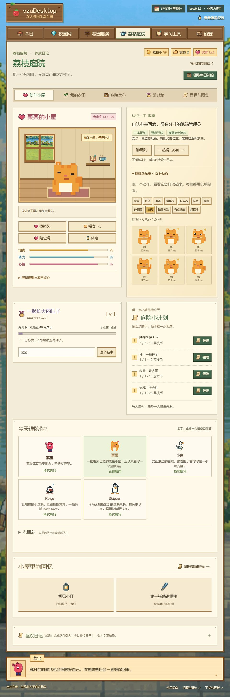
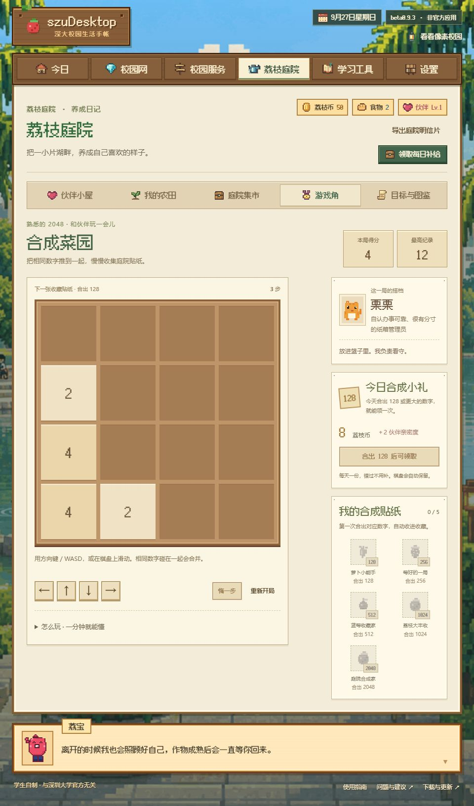
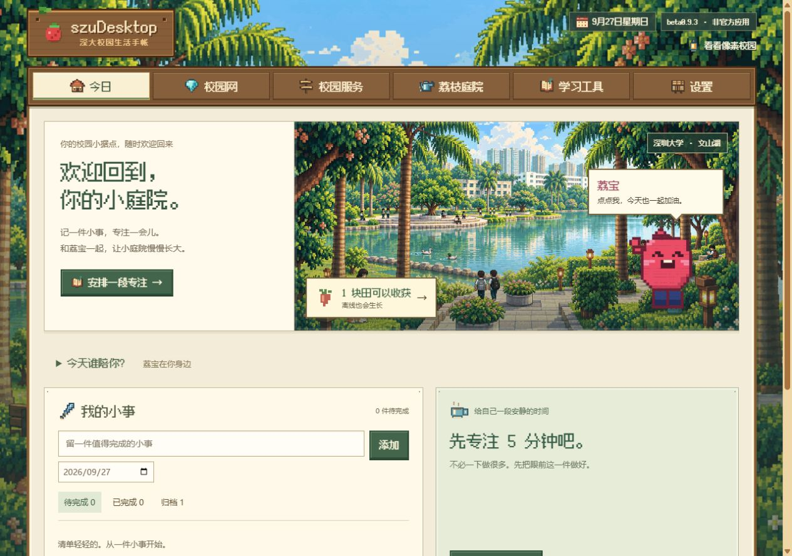
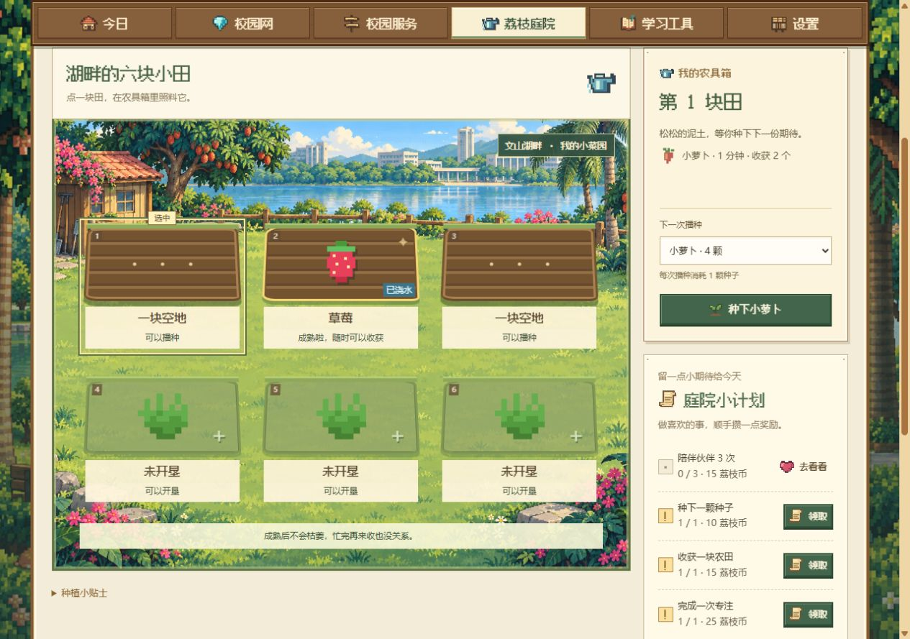
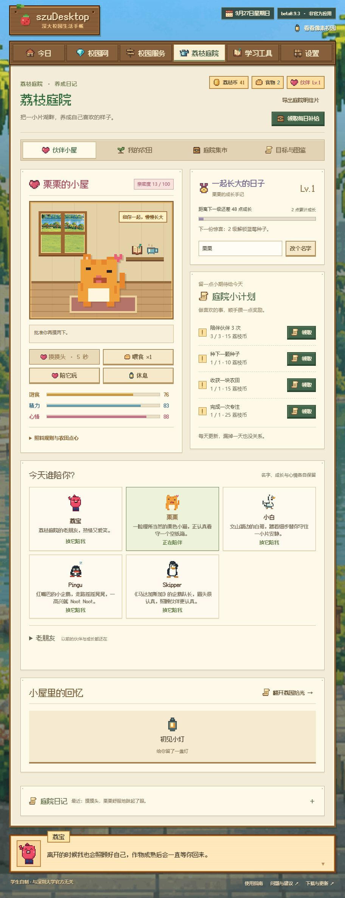

<div align="center">

# szuDesktop · Lychee Garden

A little piece of Shenzhen University, on your desktop.

Choose a pixel companion, spend a little time focusing, and come back to a harvest.
Your everyday campus tools live here too.

<p>
  
  
  
</p>

[简体中文](../README.md) · **English**

Unofficial · Built by a student · Not affiliated with Shenzhen University

**[Download for Windows · beta0.9.2](https://github.com/SzuDesktopTeam/szudesktop/releases/download/beta0.9.2/szuDesktop-Setup-0.9.2.exe)**

[Other downloads and release details](#download) · [Features](#features) · [Feedback](https://github.com/SzuDesktopTeam/szudesktop/issues) · [FAQ](#faq) · [Development status](STATUS.md)

</div>

---

## Source preview: preparing for beta0.9.3

**This is still an unpublished beta0.9.3 candidate; the download above remains beta0.9.2.** This iteration connects frame-by-frame companions, personalities and garden games with saved progression. All 32 UI and desktop check groups, real browser playthroughs and local builds passed. Remote CI results for the new installer are recorded in [STATUS section 57](STATUS.md#57-逐帧伙伴与庭院小游戏2026-09-27源码未发布). The older screenshots below belong to earlier candidates and do not establish acceptance for the new animations.

### Companions with their own movement and personality

All six species, including A-Qing in older saves, have **12 actions with 6 frames each: 432 independently rendered pixel frames**. The actions cover idle, looking around, walking, patting, eating, playing, sleeping, stretching awake, celebrating, accompanying focus, low mood and greeting. Eyes, mouths, limbs, tails and leaves change separately. The main window and floating pet share one player, with individual idle pacing and reactions to sleep, focus and care. The room's action book lets you play each action and inspect every frame. Another 30 static portraits remain available for reduced motion and postcard export.

**576 Chinese lines cover 16 contexts**, with six alternatives per species and context. Each companion's rotation progress is saved. “Chat a little” responds to sleep, hunger, tiredness and time of day; care, harvests, focus, todos and game outcomes have their own replies.

| Companion | Personality |
| :-- | :-- |
| Libao | Warm, eager to organize things and slightly clumsy; always ready to help |
| Chestnut | A serious cardboard-box supervisor convinced everything is under control; chunky abstract artwork, completely unaware of its own odd charm |
| Xiaobai | A quiet campus egret who notices small changes |
| Pingu | Curious and childlike, eager to try things; an occasional happy Noot |
| Skipper | A tactical penguin captain who schedules snacks and rest as seriously as missions |
| A-Qing | Patient and practical, taking its own steady steps; retained under “Old friends” in existing saves |



### A familiar game and two garden goals

- **Lychee Garden → Game corner: Merge Garden.** Complete 2048 rules, arrow keys, WASD, swipes and directional buttons, with short movement, merge and spawn animations. The board saves automatically, supports one-step undo and restart, and continues beyond 2048. Current and best scores are separate. First reaching 128 / 256 / 512 / 1024 / 2048 unlocks permanent stickers. Actually merging 128 or above today qualifies for one daily gift of **8 coins and 2 bond points**; keeping an old large tile does not grant a new day's reward.
- **Lychee Garden → Market: companion harvest requests.** Three fixed daily requests consume existing produce. Payment equals the produce's regular sale value plus a **3 / 3 / 4-coin** bonus, totaling 10 extra coins daily. Completing 1 / 3 / 8 / 15 requests unlocks keepsakes. Missing materials and completed deliveries are explicit; no duplicate turn-ins, streak requirement or missed-day penalty.



The 2048 rules are adapted from Gabriele Cirulli's [MIT-licensed original at a pinned revision](https://github.com/gabrielecirulli/2048/tree/478b6ec346e3787f589e4af751378d06ded4cbbc), with its [complete license retained](../desktop/assets/garden/licenses/2048-MIT.txt). Garden design takes inspiration from [Stardew Valley's farming and character relationships](https://www.stardewvalley.net/about/) and [Animal Crossing's material gathering and everyday goals](https://animalcrossing.nintendo.com/new-horizons/create/), linking harvests, companion requests and keepsakes. The request rules and writing are our own; no commercial-game artwork or code was copied for those mechanics.

To add a companion, register its stable ID and availability in `pet-catalog.mjs`, personality and dialogue in `pet-dialogue.mjs`, frame artwork in `pet-animation-art.mjs`, and timing and routines in `pet-animation.mjs`. The main window and floating pet reuse `pet-player.mjs`. New species need static portraits, all 16 dialogue contexts and 12 animation actions, plus the relevant checks. See [STATUS section 57.4](STATUS.md#574-继续添加伙伴的统一契约) for field names, exported APIs and packaging dependencies.

This garden iteration does not close unverified school-account workflows or deploy a backend, Docker, cloud sync or hot updates.

### Earlier candidate interfaces and verification

The earlier baseline `09c2240` is in draft [PR #19](https://github.com/SzuDesktopTeam/szudesktop/pull/19). [All 9 CI jobs passed](https://github.com/SzuDesktopTeam/szudesktop/actions/runs/36259475980), including an actual beta0.9.1 → beta0.9.3 installation upgrade, saved-data preservation and backup restoration. Those results do not cover the new penguins or shared catalog changes below. The PR is not merged, and public downloads remain beta0.9.2.

**These changes are not publicly released; the download above is still beta0.9.2.** The earlier beta0.9.3 candidate passed local build, key browser workflow and Windows CI installation checks. The source now also includes two penguins and refreshed companion artwork. The home, farm, study and postcard images come from the earlier candidate; the new roster is shown separately, with its validation recorded in [STATUS section 56](STATUS.md#56-宠物阵容与扩展接口2026-09-27源码未发布).



An original pixel-art lakeside scene now surrounds six working plots. Select a plot, then choose seeds, plant, water or harvest from one tool panel. The companion room brings care, growth and daily goals together. Reward messages show actual gains, and the crop collection only lights up after a real harvest.



[Earlier candidate companion room](screenshot-garden-preview.png) · [Study and weekly review](screenshot-study-preview.png) · [An actual exported garden postcard](screenshot-share-preview.png). Existing local saves remain compatible, with revised progression rules. Crops do not wither, and daily goals require no streak. The original garden backdrop was generated with the built-in image tool and is bundled with the app.

Meet **Pingu** and **Skipper**, the penguin captain from *Madagascar*: one waddles and says Noot Noot; the other takes your rest breaks very seriously. Both penguins have normal, happy, low-mood and sleeping states. Xiaobai, the campus egret, stays. Chestnut returns to its original chunky, abstract pixel proportions: utterly serious about occupying a cardboard box, and unaware of its own odd charm. New saves start with five companions. A-Qing remains under “Old friends” in existing saves, preserving names, growth and the active selection.



[Chestnut’s four expressions](cat-rough-preview.png): it takes being a cat seriously and never jokes about its own looks.

Penguin integration baseline `1f5a23b` passed [all 9 CI jobs](https://github.com/SzuDesktopTeam/szudesktop/actions/runs/36261199079), including installation upgrades and native rendering and switching for both penguins. Chestnut’s subsequent return to abstract proportions and matter-of-fact dialogue has passed real-room, interaction-line and four-state artwork checks, and the local candidate packages have been rebuilt; the earlier CI remains the penguin integration baseline. Progress and artifact records are in [STATUS section 56](STATUS.md#56-宠物阵容与扩展接口2026-09-27源码未发布).

Implemented in the current source:

- **A clearer study workflow.** Separate focus, timetable and grades views; editable todos with dates, completion records, archives and restoration. Focus accepts 1–120 minutes and an optional todo, with completed sessions in a seven-day review. It does not automatically mark the todo complete.
- **Fairer progression.** Each completed and claimed focus minute gives one garden coin and one growth point. Switching companions no longer removes crop unlocks; longer crops give more per harvest. Each companion's first three pats per day give growth, with further interaction still available.
- **Something to return to.** Seven non-consecutive visiting days unlock campus stories and keepsakes. The four static states remain, with dialogue and motion expanded to the 576 lines and 432 frames above. Preview and save a local card with the pixel campus, active companion and actual garden/focus totals, without student IDs, timetables or grades.
- **Quieter desktop company.** Installer source adds focus notifications, do-not-disturb, remembered visibility and always-on-top choices, plus opt-in Windows launch at login. Full application exit stops notifications. CI verified saved visibility preferences and writes to the always-on-top and do-not-disturb settings. Real notification display and launching after login with startup enabled remain unverified.
- **Remembered choices and clearer status.** Notice sources and undergraduate/graduate choices persist. Settings can manually check stable/beta releases, open release notes and copy credential-free feedback information. Updates are not downloaded or installed automatically.

For the earlier baseline, all 25 relevant check scripts and the Go checks passed. Real browser workflows covered focus, todo editing and archiving, planting, watering, harvesting, restored preferences, release lookup and PNG preview/save. The final farm scrolls fully without horizontal overflow at 420px; candidate files, build resources and license materials were checked. The CI build passed installation, upgrades, uninstall-with-data-retention and pet interaction checks using synthetic data on one display. Full art consistency, actual notification and startup triggers, school services, long-running resource use and longer-term balance still need their respective validation or trials. That candidate’s implementation, checksums and evidence stay in [STATUS section 55](STATUS.md#55-产品体验实施与候选版准备2026-09-27源码未发布); the new roster, shared catalog and artwork extension guide are in [section 56](STATUS.md#56-宠物阵容与扩展接口2026-09-27源码未发布).

The product review, current UX01–UX26 status and proposed seven-day trial are tracked in [STATUS section 54](STATUS.md#54-面向真实用户的完整产品审查2026-09-27分析与提案). Source improvements are not yet part of the downloadable installer. Student trials, physical multi-display testing and a complete promotional recording remain undone; internal tests do not replace them.

## What you can do today

The following describes the downloadable **beta0.9.2** release.

- **Keep a companion on your desktop.** Choose Libao, Chestnut, Xiaobai or A-Qing to accompany your work. Click to care for them, drag them into place and scroll to resize. Their names and growth stay in your local save.
- **Give focus a small reward.** Write a todo, start a 5, 25 or 45-minute focus session, then claim companion growth and garden coins. Grow crops, water them and decorate your room; crops keep growing while you are away.
- **Find campus tools in one place.** Read public college notices and the official calendar, open common school services and run diagnostics when the campus network will not connect.

The garden, todos and focus timer work offline without a school account. The floating desktop companion is included in the Windows installer; macOS and Linux currently have command-line tools.

**Personal school services are still being tested:** undergraduate/graduate timetables and grades, installer login handoff, in-app booking and college piano access are not all verified, so complete functionality is not yet guaranteed. See the [feature table](#features) for current support.

[Tell us what was awkward or what you would like to use next](https://github.com/SzuDesktopTeam/szudesktop/issues). Describe what you were trying to do and where you got stuck. Please leave out passwords, cookies and personal grades.

---

## Download

The current installer is **[szuDesktop-Setup-0.9.2.exe](https://github.com/SzuDesktopTeam/szudesktop/releases/download/beta0.9.2/szuDesktop-Setup-0.9.2.exe)**. Run it, then open szuDesktop. The Windows installer includes its window runtime and Go engine. Portable downloads, CLI binaries and checksums are on the [beta0.9.2 release page](https://github.com/SzuDesktopTeam/szudesktop/releases/tag/beta0.9.2).

| Item | Detail |
| :--- | :----- |
| Windows installer | An independent Electron window; a matching `.sha256` file verifies the download |
| Windows portable | `szudesktop-beta0.9.2-windows-amd64.zip`; unzip and run `szudesktop.exe`, using the local Edge / Chrome browser |
| Command line | Windows / macOS / Linux `szunet` binaries remain available |
| Current version | `beta0.9.2` · Released; four companions, cross-version upgrade and backup restoration checked |
| Saved data | Both Windows editions use the same local garden and study records; export a backup from Settings before updating |

The installer provides a floating desktop pet, a system tray and 40%–200% scaling. Closing the main window keeps the pet available; choose **Open main window** from the pet menu, or click the tray to reopen. Official school login and booking pages open inside the installer edition, without a cookie-copy workflow. Calendar OCR prefers Chinese. See [STATUS](STATUS.md) for the limits of live account validation. The published beta0.9.2 installer cannot enable launch at login; the local beta0.9.3 candidate adds this option, with actual launch-at-login behavior still awaiting validation.

Released on 2026-09-26: [PR #17](https://github.com/SzuDesktopTeam/szudesktop/pull/17) is merged and the [beta0.9.2 release checks](https://github.com/SzuDesktopTeam/szudesktop/actions/runs/36242237913) passed. Upgrading from the published beta0.9.1 installer preserved garden and study records, encrypted account data and pet settings, removed obsolete program resources, and passed backup export/restoration, reopening and uninstall checks. These checks use synthetic data; live school-account boundaries remain in [STATUS](STATUS.md).

**beta0.9.2 update:** four companions and synchronized desktop selection; paginated scores using the school-reported total without treating failed or timed-out reads as complete; stale account cleanup after school sign-out; and preservation of specific permission errors. The pixel campus, timber navigation, scaling and dragging remain. Changes and verification stay in [STATUS](STATUS.md).

### Desktop companion (beta0.9.2 installer)

- **Left-click or right-click** the pet to open its menu, view its current state, pat, feed, play or toggle sleep. Care uses the existing garden rules and local save; insufficient food, low energy and cooldowns are reported.
- **Scroll while hovering over the pet** to change its size by 10 percentage points, from 40% to 200%. Menu controls, the Settings slider and tray presets are also available.
- **Hold and drag the pet** to move it. Its size and position are restored after restart.
- The menu opens the companion area, farm, Study tools or main window, and can hide the pet or quit the app. Use the tray to show a hidden pet again.
- The floating pet and these desktop controls are part of the **Electron installer edition**. The portable edition keeps garden care inside its main window and has no separate pet window.
- Actual checks used one display. Physical multi-display setups have not been tested; geometry-rule tests do not replace that verification.

### Four companions

The released installer includes **Libao, Chestnut, Xiaobai the egret and A-Qing the turtle**. Select a portrait in the garden or use **Switch companion** from the desktop pet menu; both choices synchronize immediately. Existing saves receive missing base companions while retaining names, growth and the active choice. Rules, actual window switching, switching with the main window hidden, restart restoration and a 420px layout check passed.


Export a backup from Settings before upgrading. A clean Windows environment passed the real beta0.9.1 → beta0.9.2 installation upgrade and data preservation checks, plus export, cancelled restoration and confirmed restoration. New installers are still downloaded manually; automatic updates are not implemented.

The 1.0 plan focuses on the desktop app; **campus backend and Docker deployment are deferred**. Four companions are released and this cross-version upgrade is verified. Remaining work covers on-site campus authentication, real installer school-session handoff, undergraduate/graduate timetables and scores, in-app booking, college piano permissions and final 1.0 candidate delivery. Gaps stay in [STATUS section 50.2](STATUS.md#502-10-剩余任务暂不部署后端). Backend services, cloud sync and automatic updates are deferred. The installer remains unsigned.

### First run (released beta0.9.2)

1. Open **Lychee Garden → Companion room** and choose a companion. The installer edition also switches the floating desktop pet.
2. Visit **My farm** to see your first radishes already planted; they are ready in about a minute. Or write a todo and try a 5-minute focus session. No school account is needed.
3. Open notices, the calendar or official school links when you need them.

To connect to the campus network, open **Campus network**, enter your campus card number and unified identity password, then sign in. Tick **Remember** if you want credentials saved after a successful sign-in. Run **Diagnostics** if the connection fails. Campus network authentication and school business login are separate.

### Your first session in the source preview

A new save starts with 40 garden coins, three pet snacks, four radish seeds, two strawberry seeds and one already planted radish plot. Choose a companion, write a small todo and try five minutes of focus; completing and claiming it gives five coins and five growth points. Radishes take about one minute, or about 45 seconds if watered immediately, and yield two radishes plus one growth point. No school account is needed.

The story progresses over seven different visiting days without resetting when you miss a day. Records stay local. Missing dates and focus history are not invented for old saves; existing totals, companion growth and claimed medals are preserved.

### Opening and exiting

- Starting the installer edition twice focuses the existing window; it can also reuse an already running portable engine of the same version. If an older engine is reported, exit the old edition before reopening
- Closing the main window keeps the pet and tray running. Choose **Open main window** from the pet menu, or click the tray. Use **Pet menu → Quit app**, **Tray → Exit** or **Settings → Exit** to quit fully. Only the engine started by this instance is stopped; a reused service remains running. The portable edition exits about 10 seconds after all its windows close
- Reloading the page does not stop the service
- To start the service without a window, launch `szudesktop.exe` with `--no-open`
  (meant for headless / sidecar use — the Electron shell starts the Go engine the same way)
- A short, skippable guide appears on first launch; it explains where your data lives,
  how to quit, and what to try first
- The published beta0.9.2 installer can disable an existing autostart entry but does not create one. Portable and CLI autostart remain available; unreadable status is reported explicitly. The source preview's new opt-in control is described above and is not enabled on the user's behalf

### Where my data lives

- Under the `.szunet` directory in your user profile by default
- Campus network passwords are stored per platform: Windows DPAPI (only this machine and
  this Windows account can decrypt them), the macOS Keychain, and Secret Service
  (`secret-tool`) on Linux. **There is no plain-text fallback on any platform:** when the
  system secure store is unavailable, saving fails with an explicit error instead of quietly
  writing a plain-text file (F24, fixed)
- Garden saves are `workspace-v1.json`, plain JSON you can back up yourself; an export
  never contains your campus account or password
- Before switching computers, export your save in Settings and import it on the new one

---

## Features

These entries describe beta0.9.2. Verified desktop features and queries are distinguished from pending school-account workflows below, with evidence in STATUS.md.

| Capability | Status | Notes |
| :--------- | :----- | :---- |
| Campus network sign-in | ✅ | Teaching area (SRun) / dorm area (Dr.COM), zone detected automatically; sign-out and manual zone override |
| Access point ID (`ac_id`) discovery | ✅ | Tries in order: your manual value → what worked on this port before → the gateway redirect → a guess. Guesses are labelled as such |
| Connection diagnostics | ✅ | Lists zone decision, portal reachability, protocol fingerprint and the conclusion |
| Credential storage | ✅ | Windows DPAPI / macOS Keychain / Linux Secret Service; saved **only after a successful sign-in and only if you ticked "remember"**. Without a system secure store it refuses to save and says why — **no plain-text fallback** (F24, fixed). The macOS save path was validated on a real CI runner for beta0.7.3 |
| Notices | Partial | Current source groups notices by college or department: 28 academic-unit links, 17 readable college columns, plus Academic Affairs and the Graduate School. Dates and original links are preserved with a 10-minute cache; other units link to their official sites |
| Room availability and booking | Partial | Live community rooms and half-hour availability on the campus network (read-only). The interface opens the official school page for login and booking and never asks users to copy booking cookies. The server has **no booking write endpoints left** (F23, removed). Library services use a separate official system |
| Calendar and timetables | Partial | Official calendar updates and manual week overrides. Graduate alternative login and timetable reading passed with a real account, distinguishing no scheduled classes from selected courses without arrangements. Undergraduate access, populated schedules and the installer session handoff remain unverified |
| Study reminders | ✅ | Add a reminder manually, export a standard ICS calendar (15 minutes before start). **A reminder is not a booking** |
| Common contacts | Partial | Only numbers verifiable on official school pages (library help desks); other offices link to their official pages |
| Grades and GPA | Partial | Paste or import CSV / TSV grade tables and calculate GPA locally. School queries follow pages using the reported total, remain pending live account validation and do not update local GPA records automatically. **No PDF / image / XLSX parsing** |
| Todo and focus timer | ✅ | Todo list plus 5 / 25 / 45-minute focus sessions |
| Desktop pet (installer) | Released and verified | Transparent pet window, left/right-click care menu, 40%–200% wheel/slider scaling, dragging and persistent size/position. Actual shell and installer checks passed; physical multi-display setups remain untested |
| College piano rooms | Experimental | Login, paginated rooms and read-only reservations; memory-only session, pending validation with an authorized account |
| Lychee Garden | ✅ | Companion care and growth, crops, plots, watering, harvest, decorations, daily goals, achievements and a field guide. No purchases, no real-money trading |
| Save file | ✅ | Fixed local file, survives restarts and port changes, supports export / import and multi-window conflict protection |
| Launch at login | Partial (Windows only) | Portable and CLI editions retain silent autostart; the installer can disable old entries but does not create new ones. macOS / Linux explicitly report unsupported |

**Current limitations:** actual score fields and pagination still need live validation; balance is not integrated. Graduate alternative login and the current timetable have live evidence. The undergraduate page returned 403 for the test account, the official graduate scores page did not render its list, and the college piano service could not be reached. The official browser allowed slot selection and opened the booking confirmation form; no reservation was submitted. Installer room details and subsequent browser connectivity still have unresolved acceptance gaps. Full booking and business-session handoff require validation. See [STATUS.md](STATUS.md).

On 2026-09-27, the user confirmed being on the campus network without an undergraduate-authorized test account. The official graduate page was reachable but its session had expired; a new login is pending. Local room queries still encountered access failures. Source error handling now distinguishes those failures instead of always reporting a campus-network requirement. This is not a new successful school-service acceptance test.

**College notice filtering:** selecting a college automatically reads its public column. Unsupported units have an official-site link; authenticated internal notices are not included. This update is included in beta0.6.1.

**Booking flow:** the installer opens a separate official school window for WebVPN, verification, selecting a slot, submitting and viewing results. Its isolated login state lasts only until full application exit. The Go service only reads public rooms and availability; it has no reservation write endpoints and does not confirm reservations automatically. The portable edition continues to use the system browser.

**Off-campus access:** the public build uses official WebVPN pages and does not include the experimental VPN tunnel. Local Go room queries still connect directly and do not use the school window's WebVPN route. A future campus backend would serve specific supported services, not provide a system-wide VPN. Off-campus reachability and each user's business permissions must be established separately. For the school's client access, follow the [official SecureLink guide](https://www1.szu.edu.cn/nc/view.asp?id=654).

### School login, timetables and scores

In the installer edition, select undergraduate/graduate timetable or scores at the top of Study tools. Open the official login page, complete school verification, return to the main window and read the current login. Then query the selected business. Credentials stay in the school page; cookies never pass through the garden renderer or reach disk. Business access is verified separately. Closing the main window keeps the session; full application exit clears it.

The portable edition retains a collapsed alternative login workflow, including manual session import with OS-protected storage and no plaintext fallback. Never share passwords or cookies in feedback. Online scores follow pages using the school-reported total and are not added to local GPA automatically. Missing totals are labelled unconfirmed; pagination failures and timeouts report errors. Undergraduate arrangements retain school text, and graduate courses use the returned schedule.

A real graduate account passed alternative login and displayed the school's current term and courses without arrangements in the app; the official page likewise returned no scheduled classes. This does not validate populated schedules, scores or undergraduate access. beta0.9.1 fixes a blocked WebVPN authentication redirect and an outdated login hint; these fixes are included in the downloads above.

The official calendar is checked daily. Windows OCR prefers Simplified Chinese; failed refreshes preserve the cache and report the cause. Teaching weeks support manual overrides. College piano rooms use a separate campus system with read-only queries; its current HTTP service should only be used on a trusted campus network with its own credentials.

---

## How campus network authentication works

<details>
<summary>Why teaching and dormitory areas need different sign-in methods</summary>

The campus network at Shenzhen University is split into **two zones that do not
work with each other**, each using a completely different sign-in method:

| Zone | System | How it works |
| :--- | :----- | :----------- |
| Teaching / office / library areas | SRun (深澜) | Rolled out in early 2025. Password goes through HMAC-MD5, user data through XXTEA with a custom Base64, plus a SHA1 checksum |
| Dormitory / staff areas | Dr.COM (ePortal) | A single GET request is enough |

That creates two headaches:

1. **Every tutorial and script written before 2024 fails in the teaching area** —
   they were all built for the old Dr.COM.
2. **Nobody explains the error messages** — `ldap auth error`, `Rad:userid error1`,
   `登陆失败[05]`, `Unknow ac-type`… so people just guess and retry.

szuDesktop handles both: **one button to sign in, one button to tell you where it got stuck.**

It does not decide the zone by "can I reach the portal". It looks at the **protocol
fingerprint** — the handshake behaviour that only that protocol has (SRun: whether
`get_challenge` succeeds; Dr.COM: whether the ePortal login endpoint exists). The reason is
practical: the dorm portal also returns HTTP 200 on machines in the teaching area, so a
plain reachability test mis-detects the zone while offline and then fires the Dr.COM
protocol at an endpoint that isn't there.

</details>

## Command line szunet

For scripting, or when you don't want a window. Sources live in `cmd/szunet`;
build with `go build -o dist/szunet ./cmd/szunet`.

| Command | What it does |
| :------ | :----------- |
| `login` | Sign in (pass `-u` card number and `-p` password for one-off use; not saved) |
| `logout` | Sign out |
| `status` | Show current state |
| `detect` | Detect the current zone and access point ID |
| `diag` | Diagnostics: zone decision and protocol fingerprint |
| `config` | View / change local configuration |
| `autostart` | Configure launch at login (Windows only) |
| `vpn` | Guidance for the three official ways to reach the campus network from outside (WebVPN / EasyConnect / zero trust). **Guidance only — it contains no experimental VPN protocol code** |
| `version` | Show the version |

```text
szunet detect                       # which zone and access point ID it detects
szunet login --zone teaching        # force a protocol (auto / teaching / dorm)
szunet login --ac-id 12             # set the access point ID by hand
szunet diag                         # run this first when the network is down
```

Run `--help` for all flags. **Never put real credentials in shared scripts or logs.**

On macOS, credentials saved with `config set` go into the system keychain. Before writing, the
CLI self-checks that the write path works using a throwaway item; if it does not, it fails with a
clear error instead of falling back to putting the password on the command line (where other
processes on the same machine could see it).

**A defect worth stating plainly (F26):** the new macOS CI probe once hit `passwords don't match`
on real hardware — `security -w` **can** ask twice (password, then confirmation), while beta0.7.1
and beta0.7.2 fed it a single line. On such machines the macOS CLI **could not save credentials at
all**: it failed with a clear error, leaked nothing and wrote no plaintext, but the feature did not
work. The behaviour is not stable — the four later runs on the same image (macOS 26.6.2) asked only
once. It now feeds the password plus a confirmation line, which works in both cases (the "asks once"
case is verified on real hardware). **The fix ships in beta0.7.3.** That probe no longer swallows
failures and now gates the release job. See F21 / F25 / F26 in STATUS.md.

---

## FAQ

<details>
<summary><b>Sign-in fails once I plug in my own router</b></summary>

Every network port on campus has its own access point ID (`ac_id`), and you have to report
the one for the port you're plugged into. Older versions always sent `1`, while the router
line expects `12`, and the server rejects a wrong ID outright.

The app now looks for the ID in this order, using the first one that works:

| Priority | Source | Confidence |
| :-- | :-- | :-- |
| 1 | You set it yourself (`--ac-id 12`) | Highest |
| 2 | What worked on **this port** on this machine before | High |
| 3 | Read from the gateway redirect when you're not signed in yet | Authoritative |
| 4 | Trying common IDs one by one | Low (shown as "guess") |

**The ID belongs to the wall port, not to the router**: same router back in its old port →
same ID; different port → different ID; different router in the same port → same ID.

If you see "authentication failed: wrong ac_id", run `szunet detect` to see what it found.
</details>

<details>
<summary><b>My antivirus flags it</b></summary>

The portable executable and Electron installer currently lack a code-signing certificate
and may trigger a SmartScreen prompt on first run. That said, **don't dismiss
every warning as a false positive** — the code
is open source, so you can read it or build it yourself (`go build`) and compare behaviour.
</details>

<details>
<summary><b>Does it keep running after I close the window?</b></summary>

Closing the main window keeps the pet and tray running. Reopen from **Pet menu → Open main window** or the tray. Quit from the pet menu, tray or Settings to stop its own engine; a reused service stays running.
The portable edition exits about 10 seconds after all its windows close. **Settings → Exit** is also available.
</details>

<details>
<summary><b>Does it reconnect on its own in the background?</b></summary>

No. Whether to sign in is your call, made on the sign-in page. The app never fires
authentication requests on a timer behind your back.
</details>

<details>
<summary><b>Where is my password stored?</b></summary>

On Windows it's encrypted with DPAPI — only this machine and this Windows account can
decrypt it. macOS uses the system Keychain; Linux uses Secret Service. **No platform falls
back to plain text:** if the system secure store is unavailable, saving fails with an explicit
error, and "forget account" also removes any plain-text file an older version may have left
behind. It is saved **only after a successful sign-in and only if you ticked "remember"**, so
a wrong password won't overwrite the stored one. You can clear it at any time with
"forget account".
</details>

---

## Privacy and security

- **No data collection**: no telemetry, no analytics. Everything stays on your machine
- **Credentials encrypted locally**: Windows DPAPI, undecryptable on another machine or
  under another user account; macOS Keychain; Linux Secret Service. No plain-text fallback —
  saving fails with an explicit error when no system secure store is available
- **It never submits for you**: booking a room, picking courses, paying — the app gives you
  the entry point and reminders; the final action is yours, in the official system. The
  experimental server booking endpoints from beta0.6 have been removed entirely (F23), so no
  code path can submit a reservation
- **Loopback only**: the desktop service listens on `127.0.0.1` and refuses to start on a
  non-loopback address; every `/api/*` route checks Host, `Sec-Fetch-Site` and a same-origin
  `Origin`, returning 403 to any other page
- **Dorm-area sign-in is plain text**: the school's Dr.COM gateway is HTTP by default
  (`http://172.30.255.42`). That is the university's protocol, not this app's choice; the
  teaching-area SRun portal is HTTPS and **does** verify certificates
- **Nothing that bypasses billing or shares your connection**. Please follow your
  university's network rules
- **Official sources only**: notices are read from predefined school pages; the app is not
  a general-purpose web proxy

---

## Build and verify

You need Go (see `go.mod`), Python 3 and Node.js.

```text
python desktop/sync-assets.py      # sync interface assets
node   desktop/check-ui.mjs        # the regressions below all run in CI
node   desktop/check-rewards.mjs
node   desktop/check-garden-progress.mjs
node   desktop/check-campus.mjs
node   desktop/check-notices.mjs
node   desktop/check-session-ui.mjs
node   desktop/check-academic.mjs
node   desktop/check-school.mjs
node   desktop/check-booking.mjs
node   desktop/check-network-ui.mjs
node   desktop/check-workspace-ui.mjs
node   desktop/check-productivity.mjs
node   desktop/check-autostart-ui.mjs
node   desktop/check-release-ui.mjs
node   desktop/check-feedback.mjs
python desktop/check_licenses.py
node   desktop/electron/check-sidecar.mjs # Electron startup, shutdown and reuse regression
node   desktop/electron/check-window-policy.mjs
node   desktop/electron/check-pet-policy.mjs
node   desktop/electron/check-pet-settings.mjs
node   desktop/electron/check-desktop-settings.mjs
node   desktop/electron/check-pet-view.mjs
node   desktop/electron/check-school-policy.mjs
node   desktop/check-interactions.mjs
node   desktop/check-pet-commands.mjs
node   desktop/check-piano.mjs
go vet ./... && go test ./...      # static checks and unit tests
python desktop/check_release_notes.py # release-notes extraction regression
python desktop/build-windows.py    # build the Windows desktop exe (also the Electron Go sidecar)
node   desktop/electron/build.mjs  # build the Windows Electron installer (run `npm ci` in desktop/electron first)
python desktop/smoke_windows.py    # end-to-end smoke test
python desktop/make_release.py     # produce the release package (only when actually releasing; it overwrites same-named local artifacts)
```

`python desktop/electron/smoke_installer.py` installs, reopens, reinstalls and uninstalls the final package only on a disposable GitHub Windows runner. It must not be run as an installation check on a development machine. PR and tag workflows retain all build and installer checks; release assets are published only after they succeed.

Release notes live in the root [CHANGELOG.md](../CHANGELOG.md): when bumping the version,
rename the `## 未发布` ("unreleased") section to the new version. CI extracts that section as
the GitHub Release body and fails the release if it is missing or empty.
`python desktop/release_notes.py <version>` previews it locally.

The only interface sources are `desktop/index.html` and `desktop/assets/garden/`.
Don't hand-edit build outputs. The default desktop build **excludes the experimental VPN
protocol** and unverified third-party game artwork, and only links to the official WebVPN.
Experimental sources are kept for provenance review and protocol study, and must not be
presented as a finished, verified feature. The exclusion works through a build tag:
`internal/vpn` is referenced only from files guarded by `//go:build campusvpn`, and neither
CI nor the build scripts pass `-tags campusvpn`, so neither the desktop app nor the five CLI
release binaries contain that protocol code. The provenance and licensing of `internal/vpn`
are still unverified (STATUS.md F11): its package comment now says so plainly and makes no
claim of independent authorship, and F06 / F07 / F08 (false "connected" state, missing
timeouts, skipped certificate verification) are all still open. Until the provenance is
verified, this module must not be presented as a working feature or as clean-source code.

---

## Acknowledgements

- [teleostnacl/LoveSzu](https://github.com/teleostnacl/LoveSzu) — reference for undergraduate personal timetable endpoint and field names; implemented independently without copying its source code.
- [Fusion Pixel Font](https://github.com/TakWolf/fusion-pixel-font) — by TakWolf,
  SIL Open Font License 1.1; the licence ships with the package as `FONT-LICENSE-OFL.txt`
- [Sleepstars/SZU-login](https://github.com/Sleepstars/SZU-login) — attribution for the
  SRun xEncode implementation is kept in [LICENSE](../LICENSE)
- [Clash Verge Rev](https://github.com/clash-verge-rev/clash-verge-rev) and
  [FZU Helper](https://github.com/west2-online/fzuhelper-app) — references for interface
  hierarchy and how campus services are organised
- [MattDong123/tools4szu](https://github.com/MattDong123/tools4szu) — by Matt, used with the
  author's permission as research into the university's own system endpoints. No code was
  copied: the endpoint paths, dataset names and field names it documents were re-implemented
  in Go with explicit session-expiry detection. That repository declares no open-source
  licence, so this is an attribution of facts only and not a redistribution of its code

---

## Licence

MIT — see [LICENSE](../LICENSE).

Third-party components keep their own licences: Fusion Pixel Font is under OFL 1.1, and the
experimental VPN module's third-party provenance is still being verified and is not included
in default desktop builds. Names such as EasyConnect remain the property of their
respective owners.
