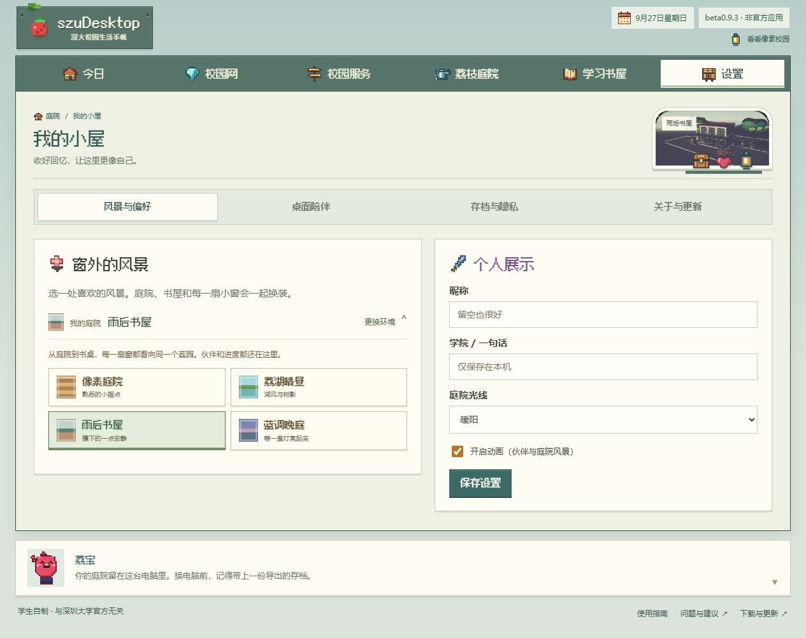
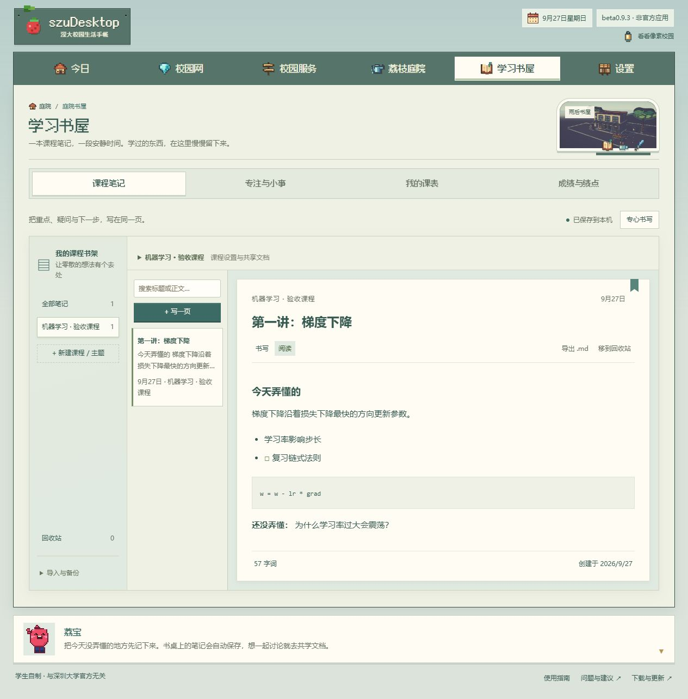
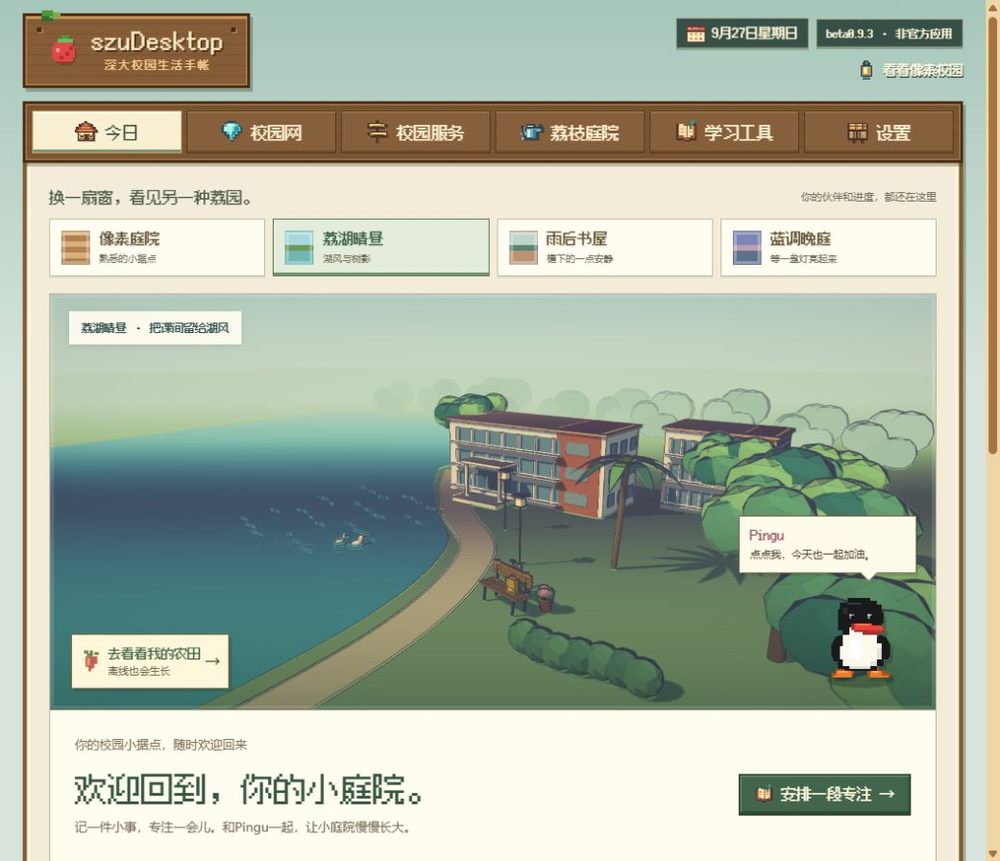
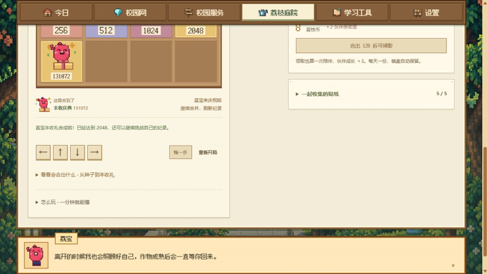
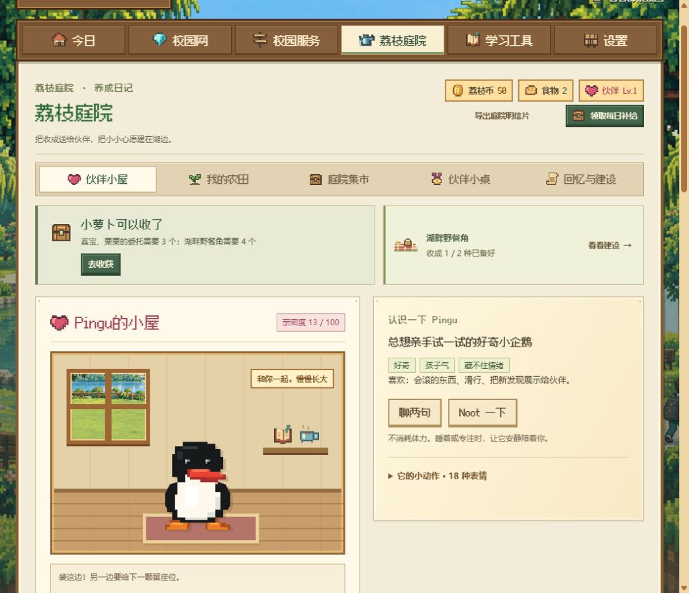
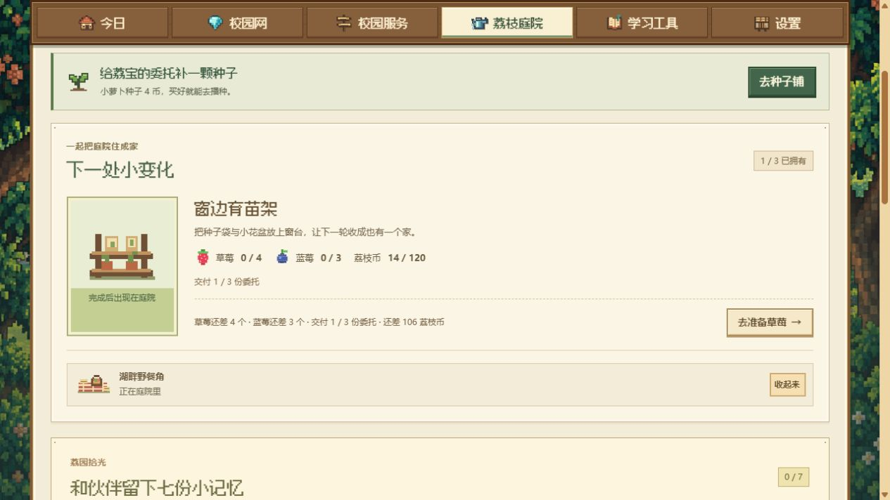
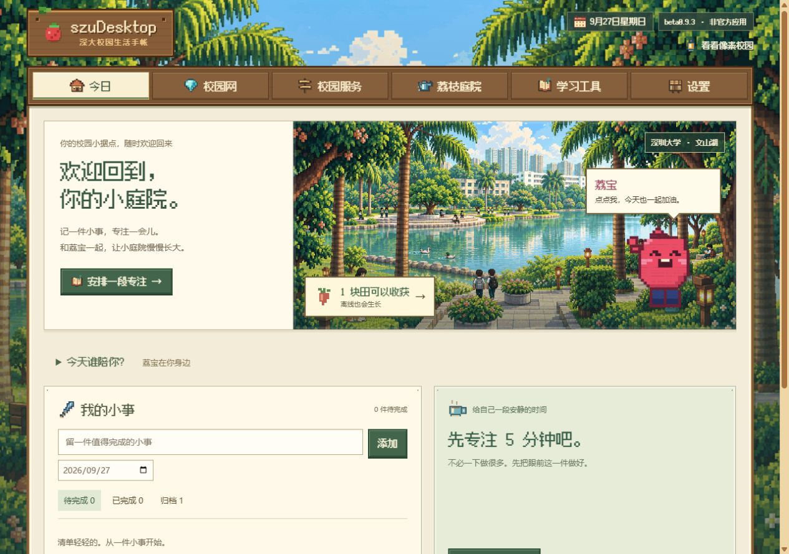
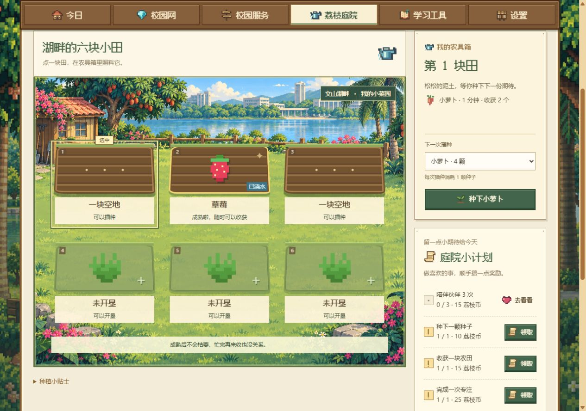
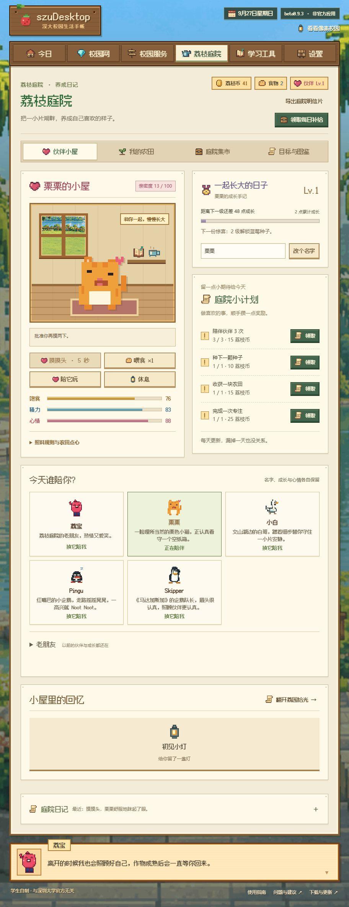

<div align="center">

# szuDesktop · Lychee Garden

A little piece of Shenzhen University, on your desktop.

Choose a pixel companion, spend a little time focusing, and come back to a harvest.
Your everyday campus tools live here too.

<p>
  
  
  
</p>

[简体中文](../README.md) · **English**

Unofficial · Built by a student · Not affiliated with Shenzhen University

**[Download for Windows · beta0.9.3](https://github.com/SzuDesktopTeam/szudesktop/releases/download/beta0.9.3/szuDesktop-Setup-0.9.3.exe)**

[Other downloads and release details](#download) · [Features](#features) · [Feedback](https://github.com/SzuDesktopTeam/szudesktop/issues) · [FAQ](#faq) · [Development status](STATUS.md)

</div>

---

## beta0.9.4 release candidate and complete feature set

**beta0.9.4 is waiting for PR checks and release packaging; beta0.9.3 remains the latest public release, and the download above points to it.** The candidate fixes issues found in the second release audit: save recovery, campus credential redaction, app shutdown, CJK word counting and conflict synchronisation. Every build check now reads the single version source. See [CHANGELOG](../CHANGELOG.md) and [STATUS section 67](STATUS.md#s67) for the full record. beta0.9.4 retains the complete feature set introduced in beta0.9.3; real school transactions and Feishu collaboration keep their existing acceptance limits.

### One courtyard, across every page

Compact room windows replace oversized headers and repeated labels. The garden shows the selected pet, farm or game before suggestions; pet care controls appear above the room. Dusk uses consistent warm paper and readable ink across projects, the action book, 2048 and orders, fixing pale text on pale cards.

Settings has four sections: **Appearance / Desktop companion / Backups and privacy / About and updates**. Narrow windows use two-column section controls, and unsaved profile edits survive section changes without being saved automatically. Timetable, notices, farm and settings sections survive refresh and browser back/forward. Notes show result counts and a clear-search action while retaining the current draft; long course shelves and note lists scroll independently.

School login and online grades follow one undergraduate/postgraduate choice. Timetable reads show pending and retry states; calendar failures stop displaying a loading message, and empty notices have an explicit explanation. These are interface improvements, not evidence of successful real-account or booking acceptance.



### Pick up where you left off

On wide windows, the study-desk entrance and courtyard landscape sit side by side; narrow windows stack them. The welcome area shows **unfinished tasks, accumulated focus minutes and harvest-ready plots** from local records. The latest note and next garden activity appear together, so returning to a page or taking care of something nearby takes fewer steps.

The preceding PR #21 was viewed at regular desktop width and 420px, in daylight and dusk, using Pixel Courtyard and After-rain Bookshop. Home and notes showed no horizontal overflow. Outline navigation, moving notes between courses and unfiled, continuing the latest page and exporting a backup from Settings were exercised with synthetic content. Build delivery remains tracked in STATUS section 64.2.


The network page starts with connection status, refresh and diagnosis. When internet access is available, expand the login form only when connecting or changing accounts. Learning spaces now have one primary **Open school booking** action and a secondary availability lookup. Library links appear before the detailed, expandable rules. Entering the notices section automatically reads the remembered department once; failures remain visible and can be retried manually, without background polling.

The installer also checks that its complete version matches the background engine. A mismatch asks the user to exit the older version and reopen the app; it does not terminate an existing portable engine. This behavior has been retained since beta0.9.3; the limits on verified school bookings and account permissions remain unchanged.

### From the courtyard to your study desk

Choose **Write notes in the bookshop** on the home scene, or **Study bookshop → Course notes**. Create courses manually without a school login. Start with a blank page, lecture notes or a reading/meeting template; search titles and text, write and read Markdown, enter a focused writing view, and restore pages from the trash. Changes save locally with visible status. If another window saves first, the current draft remains available to export before loading the newer version. Normal application exit first saves the notebook; a failure defaults to returning to the app, with an explicit choice required to discard unsaved changes and exit. Clicking another action while a save is in progress explains why it must wait.

Turn a selected sentence into a study task, or start **25 minutes of focus** from the writing toolbar. An expandable **page outline** jumps to headings while writing or reading, and the current page can be moved to another course. **Continue writing** on home selects the most recently edited non-deleted page and clears an old search or trash filter. Word counts and imported content do not directly earn garden rewards.

Import Markdown/TXT, export an individual `.md`, or export and restore the whole notebook as JSON, including courses, notes, current drafts and trash. **Back up course notes** in Settings now directly exports the whole notebook; the course shelf's backup control remains available. Notes live in `.szunet/notebook-v1.json` as **unencrypted local text**, separately from `workspace-v1.json`; back up both when moving computers. This is currently a text notebook: AI assistance, PDF/slide parsing, image attachments and cloud sync are not implemented.



The previous PR #20 passed Go tests and static checks, 30 desktop check scripts and 8 Electron check groups. An isolated profile exercised creation, saving on navigation, engine-restart recovery, reading, search, trash restoration, selection-to-task and focus; that packaged application also passed its companion, backup and normal-exit checks. The image shows that **isolated acceptance-test course**, not a user's class materials, and predates the new outline controls. Its width and runtime evidence remain in STATUS section 63.4; UI, build and PR acceptance for the current changes are tracked in section 64.

### Shared course work in Feishu, personal notes on your machine

Each course can link to a Feishu Docx or Wiki document the user has permission to access. **Open shared document** opens the official Feishu page in a separate window in the installer edition, or a browser in portable/browser mode. Feishu handles collaborative editing, comments and permissions.

To import content, the app calls **the user's own installed and configured `lark-cli`**, uses that user's authorization, and creates a new local note with its source link. The connection control opens official read-only authorization. Without a configured CLI, the shared original can still be opened. **This is not two-way sync**: local edits are not written back, and the app does not substitute a shared developer account for the user.

The official window's login and CLI read authorization are separate. The window retains its session only during the current application run; CLI credentials remain managed by the user's CLI. The installed CLI was detected on the actual machine, and its missing user authorization was reported correctly; authorization was not started and private documents were not imported. This release does not create an organization, invite members or change document permissions. A project-specific organization joining flow still needs configuration. Real Feishu login, permission-constrained document import and multi-user collaboration remain unverified; implementation alone is not evidence of those workflows passing.

### A different window onto campus

Open **Change environment** at the top of the home page to choose **Lakeside Daylight, After-rain Bookshop or Blue-hour Terrace**, or return to the original **Pixel Courtyard**. The same environment extends across home, study, campus services, network, garden and settings: the bookshop, noticeboard, connection station and cottage share light, paper, navigation and window views. Ordinary text navigation remains available. The selection is saved locally; companions, crops and tasks keep their progress, and the picker folds away after selection.

| Scene | Outside the window |
|---|---|
| Lakeside Daylight | A curved lake path, southern palms, white-and-red campus buildings and a bicycle beside a bench |
| After-rain Bookshop | A recessed shopfront, bookshelves, awning and a quiet seat beside potted plants |
| Blue-hour Terrace | Stepped terraces, a seedling rack, warm windows and strings of lights at dusk |



[View After-rain Bookshop](screenshot-home-bookshop-preview.png) · [View Blue-hour Terrace](screenshot-home-terrace-preview.png)

These campus-inspired scenes use real 3D geometry. The stepped lighting, tinted shadows, depth ink, sky and colour pipeline are adapted from MIT-licensed [Sakura Crossing](https://github.com/Kenton-GMI/sakura-crossing), with Three.js 0.180.0 bundled locally. Scene geometry is new work for this project; attribution and adaptations are recorded in [Third-party notices](../THIRD_PARTY_NOTICES.md).

The visible page uses one shared scene canvas: home has the full landscape, other rooms use compact windows, and the notebook has a smaller entrance to leave room for writing. Navigation reattaches the existing canvas while environment and motion settings match; changing either releases the old resources. Offscreen and background scenes pause. Disabling animation or using system reduced motion produces a still frame; if 3D is unavailable, the pixel campus and normal controls remain accessible.

Pet care and task saves reuse the same canvas, keeping background animation continuous. A small nameplate replaces the idle companion bubble; replies expand briefly and fold away again. Dusk text contrast, distant greenery and bookshop paving have also been refined.

The bottom hint bar now follows the active companion, keeping its portrait and name consistent after switching, renaming, navigation and reopening. This fix is included in the beta0.9.3 installer; see STATUS section 60.4 for verification.

### Bring the harvest to the companion table

The 2048 tiles now belong to the same garden: **2 seed bag → 4 sprout → 8 radish → 16 strawberry → 32 blueberry → 64 lychee → 128 radish basket → 256 strawberry basket → 512 blueberry basket → 1024 lychee basket → 2048 Libao harvest gift**. At 4096 and beyond, celebration decorations appear while the complete number remains visible.

The farm and board share crop artwork, and moving tiles use the same drawings as settled tiles. A small trail shows the current harvest and the next tier; the full illustrated guide stays collapsed until opened. Merge rules, scoring, saves, undo and the daily seed gift are unchanged. Board illustrations do not directly become stored produce: claiming the existing gift still connects a game to planting.



This screenshot uses a preset board to inspect all 11 designs. It is not a completed run from a fresh game or evidence of a naturally earned score.

### Companions with their own movement and personality

All six species, including A-Qing in older saves, have **18 actions with 6 frames each: 648 independently rendered pixel frames**. The existing daily actions gain **watering, carrying a harvest, offering a gift, building, pondering and a signature gesture**. Watering cans, baskets, gift boxes and hammers have preparation, action and settling poses, while eyes, mouths, limbs, tails and leaves change separately. The main window and floating pet share one player. The action book groups daily, interaction and garden actions, with playback and an expandable view of every frame. Another 30 static portraits remain available for reduced motion and postcard export.

**Pingu has been redrawn.** Small bead eyes on a black face, a round head and short neck, a broad white chest and belly, a projecting red beak and wide orange feet share one drawing across static and animated states. His beak opens into a trumpet for Noot. Skipper retains his own upright stance, white face and low brows.

Saving the animation setting or starting a custom focus session immediately synchronizes the desktop pet; a failed save does not notify it early. Sleep and focus take priority, signature gestures do not interrupt them, and reduced motion uses static art. This build passed installation upgrade, reopen and shared-sidecar checks: system reduced motion was respected, real frame progression was captured with animation permitted only in the isolated renderer, and media conditions and preferences were restored. No Windows settings were changed.

**1,656 Chinese lines cover 23 contexts**, with 12 alternatives per species and context. Each companion's rotation progress is saved. New replies cover planting, watering, request delivery, construction, seed supplies, starting focus and signature gestures. Chestnut remains an entirely self-assured cardboard-box supervisor; Pingu is curious about little objects, while Skipper treats even rest as logistics. Dialogue follows events rather than continually interrupting you.

The active companion now appears beside the farm, so planting, watering and harvests can show its reaction where the action happens. Signature gestures are free: they spend no resources and grant no growth or bond. Crop, request and minigame reward rules are unchanged in this iteration.

| Companion | Personality | Signature gesture |
| :-- | :-- | :-- |
| Libao | Warm, eager to organize things and slightly clumsy; always ready to help | Raises a little cheering sign |
| Chestnut | A serious cardboard-box supervisor convinced everything is under control; chunky abstract artwork, completely unaware of its own odd charm | Inspects and sits in a box |
| Xiaobai | A quiet campus egret who notices small changes | Preens its feathers |
| Pingu | Curious and childlike, eager to try things; an occasional happy Noot | Opens his red beak for a trumpet Noot |
| Skipper | A tactical penguin captain who schedules snacks and rest as seriously as missions | Surveys the garden through a telescope |
| A-Qing | Patient and practical, taking its own steady steps; retained under “Old friends” in existing saves | Lifts a small leaf umbrella |



[View all six Noot frames](screenshot-pet-signatures-preview.png) · [View the farm companion and its replies](screenshot-pet-farm-preview.png)

### From a single seed to a new corner of the garden

**Focus and companionship → seeds and planting → harvests → companion requests and construction → visible scenery and collections.** These rules replace the initial minigame reward in section 57, using the same seeds, produce, coins and companion progression throughout.

- **Companion table · Prepare seeds together.** Full 2048 rules retain arrow-key / WASD / swipe input, saved boards, one-step undo and best scores. Actually merging 128 or above today unlocks one daily gift: **one needed seed, 8 coins, +3 growth, +2 bond and +10 mood**, counting as one daily care interaction. The seed fills a shortage in unfinished requests or the next project, taking stored produce, existing seeds and growing crops into account; locked crops are excluded. Go straight to planting after claiming. An old large tile cannot qualify for another day's gift.
- **My farm · Harvests with a purpose.** Seed selection shows which companions and project need the crop. An incomplete request leads directly to that crop and an empty plot. Produce can also be fed to companions in their room. The market's “Sell surplus” retains materials for today's unfinished requests and the next construction project, selling only the remainder.
- **Garden market · Deliver to the companion who asked.** Three fixed daily requests pay regular produce value plus **3 / 3 / 4 coins**. The requesting companion gains **+5 growth and +3 bond**, even when another pet is currently active. Completing 1 / 3 / 8 / 15 requests unlocks keepsakes, with no missed-day penalty.
- **Memories and construction · Make harvests visible.** Construction spends the materials and coins below and places the finished item automatically. Putting an owned item away or displaying it again is free. Built decorations appear in the home, companion room and farm pixel scenes.
- **Room collection and “Next step”.** Five 2048 milestone stickers, request keepsakes and visit-story mementos share the companion room. The home and garden suggest one actionable next step from real progress, leading to a ripe plot, deliverable request, construction, seed shop or focus session. Growing crops count toward what is already being prepared.

| Garden project | Unlock condition | First construction cost |
| :-- | :-- | :-- |
| Lakeside picnic corner | Harvest 3 times | 60 coins + 4 radishes + 2 strawberries |
| Window seedling shelf | Deliver 3 requests | 120 coins + 4 strawberries + 3 blueberries |
| Lakeside lantern path | Deliver 8 requests | 240 coins + 4 blueberries + 3 lychees |

The original daily supply remains 20 coins, one food item and two radish seeds, separate from the companion table's daily seed gift. Focus, planting and care can support garden progression without a mandatory 2048 milestone.



[See the farm and its completed picnic corner](screenshot-garden-loop-preview.png)

The 2048 rules are adapted from Gabriele Cirulli's [MIT-licensed original at a pinned revision](https://github.com/gabrielecirulli/2048/tree/478b6ec346e3787f589e4af751378d06ded4cbbc), with its [complete license retained](../desktop/assets/garden/licenses/2048-MIT.txt). Garden design takes inspiration from [Stardew Valley's farming and character relationships](https://www.stardewvalley.net/about/) and [Animal Crossing's material gathering and everyday goals](https://animalcrossing.nintendo.com/new-horizons/create/), linking harvests, companion requests and keepsakes. The request rules and writing are our own; no commercial-game artwork or code was copied for those mechanics.

To add a companion, register its stable ID and availability in `pet-catalog.mjs`, personality and dialogue in `pet-dialogue.mjs`, frame artwork in `pet-animation-art.mjs`, and timing and routines in `pet-animation.mjs`. The main window and floating pet reuse `pet-player.mjs`. New species need static portraits, all 23 dialogue contexts with 12 lines each, and 18 animation actions with 6 frames each, plus the relevant checks. This iteration’s extension requirements are in [STATUS section 59.3](STATUS.md#s59-3); [section 57.4](STATUS.md#s57-4) retains the base field names, exported APIs and packaging dependencies.

This garden iteration does not close unverified school-account workflows or deploy a backend, Docker, cloud sync or hot updates.

### Earlier candidate interfaces and verification

The earlier baseline `09c2240` passed [all 9 CI jobs](https://github.com/SzuDesktopTeam/szudesktop/actions/runs/36259475980) while [PR #19](https://github.com/SzuDesktopTeam/szudesktop/pull/19) was a draft, including a beta0.9.1 → beta0.9.3 installation upgrade, saved-data preservation and backup restoration. Those historical results do not cover the later penguins, catalog changes or this notebook. PR #19 subsequently completed its final checks and merged, as recorded in STATUS section 62; this work was eventually published in beta0.9.3 on 2026-09-27.

The earlier beta0.9.3 candidate passed local build, key browser workflow and Windows CI installation checks; the release also includes two penguins and refreshed companion artwork. The home, farm, study and postcard images come from the earlier candidate; the new roster is shown separately, with its validation recorded in [STATUS section 56](STATUS.md#s56).



An original pixel-art lakeside scene now surrounds six working plots. Select a plot, then choose seeds, plant, water or harvest from one tool panel. The companion room brings care, growth and daily goals together. Reward messages show actual gains, and the crop collection only lights up after a real harvest.



[Earlier candidate companion room](screenshot-garden-preview.png) · [Study and weekly review](screenshot-study-preview.png) · [An actual exported garden postcard](screenshot-share-preview.png). Existing local saves remain compatible, with revised progression rules. Crops do not wither, and daily goals require no streak. The original garden backdrop was generated with the built-in image tool and is bundled with the app.

Meet **Pingu** and **Skipper**, the penguin captain from *Madagascar*: one waddles and says Noot Noot; the other takes your rest breaks very seriously. Both penguins have normal, happy, low-mood and sleeping states. Xiaobai, the campus egret, stays. Chestnut returns to its original chunky, abstract pixel proportions: utterly serious about occupying a cardboard box, and unaware of its own odd charm. New saves start with five companions. A-Qing remains under “Old friends” in existing saves, preserving names, growth and the active selection.



[Chestnut’s four expressions](cat-rough-preview.png): it takes being a cat seriously and never jokes about its own looks.

Penguin integration baseline `1f5a23b` passed [all 9 CI jobs](https://github.com/SzuDesktopTeam/szudesktop/actions/runs/36261199079), including installation upgrades and native rendering and switching for both penguins. Chestnut’s subsequent return to abstract proportions and matter-of-fact dialogue has passed real-room, interaction-line and four-state artwork checks, and the local candidate packages have been rebuilt; the earlier CI remains the penguin integration baseline. Progress and artifact records are in [STATUS section 56](STATUS.md#s56).

beta0.9.3 also includes:

- **A clearer study workflow.** Separate focus, timetable and grades views; editable todos with dates, completion records, archives and restoration. Focus accepts 1–120 minutes and an optional todo, with completed sessions in a seven-day review. It does not automatically mark the todo complete.
- **Fairer progression.** Each completed and claimed focus minute gives one garden coin and one growth point. Switching companions no longer removes crop unlocks; longer crops give more per harvest. Each companion's first three pats per day give growth, with further interaction still available.
- **Something to return to.** Seven non-consecutive visiting days unlock campus stories and keepsakes. The four static states remain, with dialogue and motion expanded to the 1,656 lines and 648 frames above. Preview and save a local card with the pixel campus, active companion and actual garden/focus totals, without student IDs, timetables or grades.
- **Quieter desktop company.** The installer adds focus notifications, do-not-disturb, remembered visibility and always-on-top choices, plus opt-in Windows launch at login. Full application exit stops notifications. CI verified saved visibility preferences and writes to the always-on-top and do-not-disturb settings. Real notification display and launching after login with startup enabled remain unverified.
- **Remembered choices and clearer status.** Notice sources and undergraduate/graduate choices persist. Settings can manually check stable/beta releases, open release notes and copy credential-free feedback information. Updates are not downloaded or installed automatically.

For the earlier baseline, all 25 relevant check scripts and the Go checks passed. Real browser workflows covered focus, todo editing and archiving, planting, watering, harvesting, restored preferences, release lookup and PNG preview/save. The final farm scrolls fully without horizontal overflow at 420px; candidate files, build resources and license materials were checked. The CI build passed installation, upgrades, uninstall-with-data-retention and pet interaction checks using synthetic data on one display. Full art consistency, actual notification and startup triggers, school services, long-running resource use and longer-term balance still need their respective validation or trials. That candidate’s implementation, checksums and evidence stay in [STATUS section 55](STATUS.md#s55); the new roster, shared catalog and artwork extension guide are in [section 56](STATUS.md#s56).

The product review, the UX01–UX26 tasks and acceptance criteria, and the proposed seven-day trial are recorded in [STATUS section 54](STATUS.md#s54); open items are summarised in [section 1.1](STATUS.md#s1-1). Student trials, physical multi-display testing and a complete promotional recording remain undone; internal tests do not replace them.

## What you can do today

The following describes the downloadable **beta0.9.3** release.

- **Keep a companion on your desktop.** Choose Libao, Chestnut, Xiaobai, Pingu or Skipper to accompany your work; A-Qing stays under “Old friends” in existing saves. Click to care for them, drag them into place and scroll to resize. Their names and growth stay in your local save.
- **Give focus a small reward.** Write a todo, start a 5, 25 or 45-minute focus session (or set your own length), then claim companion growth and garden coins. Grow crops, water them and decorate your room; crops keep growing while you are away.
- **Find campus tools in one place.** Read public college notices and the official calendar, open common school services and run diagnostics when the campus network will not connect.

The garden, todos and focus timer work offline without a school account. The floating desktop companion is included in the Windows installer; macOS and Linux currently have command-line tools.

**Personal school services are still being tested:** undergraduate/graduate timetables and grades, installer login handoff, in-app booking and college piano access are not all verified, so complete functionality is not yet guaranteed. See the [feature table](#features) for current support.

[Tell us what was awkward or what you would like to use next](https://github.com/SzuDesktopTeam/szudesktop/issues). Describe what you were trying to do and where you got stuck. Please leave out passwords, cookies and personal grades.

---

## Download

The current public installer is **[szuDesktop-Setup-0.9.3.exe](https://github.com/SzuDesktopTeam/szudesktop/releases/download/beta0.9.3/szuDesktop-Setup-0.9.3.exe)**. Run it, then open szuDesktop. The Windows installer includes its window runtime and Go engine. Portable downloads, CLI binaries and checksums are on the [beta0.9.3 release page](https://github.com/SzuDesktopTeam/szudesktop/releases/tag/beta0.9.3).

| Item | Detail |
| :--- | :----- |
| Windows installer | An independent Electron window; a matching `.sha256` file verifies the download |
| Windows portable | `szudesktop-beta0.9.3-windows-amd64.zip`; unzip and run `szudesktop.exe`, using the local Edge / Chrome browser |
| Command line | Windows / macOS / Linux `szunet` binaries remain available; since beta0.9.3 the single-file EXE and every CLI binary also ship with a matching `.sha256` |
| Current version | `beta0.9.3` · Released 2026-09-27; beta0.9.2 → beta0.9.3 installer upgrade checked |
| Saved data | Both Windows editions use the same local garden and study records; export a backup from Settings before updating |

The installer provides a floating desktop pet, a system tray and 40%–200% scaling. Closing the main window keeps the pet available; choose **Open main window** from the pet menu, or click the tray to reopen. Official school login and booking pages open inside the installer edition, without a cookie-copy workflow. Calendar OCR prefers Chinese. See [STATUS](STATUS.md) for the limits of live account validation. The installer can enable launch at login from **Settings → Desktop companion → Launch when signing in to Windows**; it is off by default, and the actual launch after signing in still awaits validation.

Released on 2026-09-27: tagged from `67e89a7` after [PR #23](https://github.com/SzuDesktopTeam/szudesktop/pull/23) merged, with the [beta0.9.3 release checks](https://github.com/SzuDesktopTeam/szudesktop/actions/runs/36339282225) passing. Upgrading from the published beta0.9.2 installer preserved garden and study records, encrypted account data and pet settings, removed obsolete program resources, trimmed the locale packs, and passed backup export/restoration, reopening, coexistence with a portable engine and uninstall checks (uninstalling also removes the launch-at-login entry). These checks use synthetic data; live school-account boundaries remain in [STATUS](STATUS.md).

Release preparation: dependency updates from PRs #24 and #25 are merged. The second-audit fixes are waiting for [PR #26](https://github.com/SzuDesktopTeam/szudesktop/pull/26) CI and the installer-upgrade smoke test before beta0.9.4 can be published. The latest public installer remains beta0.9.3. Tests use synthetic data; real school accounts, booking submission and college piano permissions still need on-site acceptance.

**beta0.9.3 update:** the courtyard becomes the whole-app environment (Pixel Courtyard plus three toon-rendered scenes); course notes with Feishu course documents; five default companions with 648 animation frames; 2048 tied back into the garden economy with requests and construction; and the review fixes, including per-run local API credentials, campus-network password redaction and automatic save recovery. Full entries are in [CHANGELOG](../CHANGELOG.md) (Chinese). The previous beta0.9.2 (2026-09-26) delivered four companions with synchronized desktop selection, paginated score reads and school-login fixes.

### Desktop companion (installer)

- **Left-click or right-click** the pet to open its menu, view its current state, pat, feed, play or toggle sleep. Care uses the existing garden rules and local save; insufficient food, low energy and cooldowns are reported.
- **Scroll while hovering over the pet** to change its size by 10 percentage points, from 40% to 200%. Menu controls, the Settings slider and tray presets are also available.
- **Hold and drag the pet** to move it. Its size and position are restored after restart.
- The menu opens the companion area, farm, Study tools or main window, and can hide the pet or quit the app. Use the tray to show a hidden pet again.
- The floating pet and these desktop controls are part of the **Electron installer edition**. The portable edition keeps garden care inside its main window and has no separate pet window.
- Actual checks used one display. Physical multi-display setups have not been tested; geometry-rule tests do not replace that verification.

### Companions

New saves start with **Libao, Chestnut, Xiaobai the egret, Pingu and Skipper**; A-Qing the turtle stays under “Old friends” in existing saves. Select a portrait in the garden or use **Switch companion** from the desktop pet menu; both choices synchronize immediately. Existing saves receive missing base companions while retaining names, growth and the active choice. Rules, actual window switching, switching with the main window hidden, restart restoration and a 420px layout check passed.


Export a backup from Settings before upgrading. A clean Windows CI environment passed the beta0.9.2 → beta0.9.3 installation upgrade, data preservation and backup export/restoration checks. The beta0.9.3 → beta0.9.4 upgrade check is pending candidate CI. New installers are still downloaded manually; automatic updates are not implemented.

The 1.0 plan focuses on the desktop app; **campus backend and Docker deployment are deferred**. Five default companions are released and the beta0.9.2 → beta0.9.3 upgrade is verified. Remaining work covers on-site campus authentication, real installer school-session handoff, undergraduate/graduate timetables and scores, in-app booking, college piano permissions and feedback from real students. Open items are summarised in [STATUS section 1.1](STATUS.md#s1-1); school-service acceptance details stay in [section 50.2](STATUS.md#s50-2). Backend services, cloud sync and automatic updates are deferred. The installer remains unsigned.

### First run

1. Open **Lychee Garden → Companion room** and choose a companion. The installer edition also switches the floating desktop pet.
2. Visit **My farm** to see your first radishes already planted; they are ready in about a minute. Or write a todo and try a 5-minute focus session. No school account is needed.
3. Open notices, the calendar or official school links when you need them.

To connect to the campus network, open **Campus network**, enter your campus card number and unified identity password, then sign in. Tick **Remember** if you want credentials saved after a successful sign-in. Run **Diagnostics** if the connection fails. Campus network authentication and school business login are separate.

### Your first session with a new save

A new save starts with 40 garden coins, three pet snacks, four radish seeds, two strawberry seeds and one already planted radish plot. Choose a companion, write a small todo and try five minutes of focus; completing and claiming it gives five coins and five growth points. Radishes take about one minute, or about 45 seconds if watered immediately, and yield two radishes plus one growth point. No school account is needed.

The story progresses over seven different visiting days without resetting when you miss a day. Records stay local. Missing dates and focus history are not invented for old saves; existing totals, companion growth and claimed medals are preserved.

### Opening and exiting

- Starting the installer edition twice focuses the existing window; it can also reuse an already running portable engine of the same version. If an older engine is reported, exit the old edition before reopening
- Closing the main window keeps the pet and tray running. Choose **Open main window** from the pet menu, or click the tray. Use **Pet menu → Quit app**, **Tray → Exit** or **Settings → About and updates → Quit app** to quit fully. Only the engine started by this instance is stopped; a reused service remains running. The portable edition exits about 10 seconds after all its windows close
- Reloading the page does not stop the service
- To start the service without a window, launch `szudesktop.exe` with `--no-open`
  (meant for headless / sidecar use — the Electron shell starts the Go engine the same way)
- A short, skippable guide appears on first launch; it explains where your data lives,
  how to quit, and what to try first
- The installer never registers launch at login by itself: **Settings → Desktop companion → Launch when signing in to Windows** registers it only when you turn it on, and uninstalling removes it. Portable and CLI autostart remain available; unreadable status is reported explicitly

### Where my data lives

- Under the `.szunet` directory in your user profile by default
- Campus network passwords are stored per platform: Windows DPAPI (only this machine and
  this Windows account can decrypt them), the macOS Keychain, and Secret Service
  (`secret-tool`) on Linux. **There is no plain-text fallback on any platform:** when the
  system secure store is unavailable, saving fails with an explicit error instead of quietly
  writing a plain-text file (F24, fixed)
- Garden saves are `workspace-v1.json`, plain JSON you can back up yourself; an export
  never contains your campus account or password
- Course notes are stored separately in **unencrypted** `notebook-v1.json`. Use **Back up course notes** in Settings or the course shelf's import/backup menu. The garden backup does not include notes
- Before switching computers, export your save in Settings and import it on the new one

---

## Features

These entries describe beta0.9.3. Verified desktop features and queries are distinguished from pending school-account workflows below, with evidence in STATUS.md.

| Capability | Status | Notes |
| :--------- | :----- | :---- |
| Campus network sign-in | ✅ | Teaching area (SRun) / dorm area (Dr.COM), zone detected automatically; sign-out and manual zone override |
| Access point ID (`ac_id`) discovery | ✅ | Tries in order: your manual value → what worked on this port before → the gateway redirect → a guess. Guesses are labelled as such |
| Connection diagnostics | ✅ | Lists zone decision, portal reachability, protocol fingerprint and the conclusion |
| Credential storage | ✅ | Windows DPAPI / macOS Keychain / Linux Secret Service; saved **only after a successful sign-in and only if you ticked "remember"**. Without a system secure store it refuses to save and says why — **no plain-text fallback** (F24, fixed). The macOS save path was validated on a real CI runner for beta0.7.3 |
| Notices | Partial | Notices are grouped by college or department: 28 academic-unit links, 17 readable college columns, plus Academic Affairs and the Graduate School. Dates and original links are preserved with a 10-minute cache; other units link to their official sites |
| Room availability and booking | Partial | Live community rooms and half-hour availability on the campus network (read-only). The interface opens the official school page for login and booking and never asks users to copy booking cookies. The server has **no booking write endpoints left** (F23, removed). Library services use a separate official system |
| Calendar and timetables | Partial | Official calendar updates and manual week overrides. Graduate alternative login and timetable reading passed with a real account, distinguishing no scheduled classes from selected courses without arrangements. Undergraduate access, populated schedules and the installer session handoff remain unverified |
| Study reminders | ✅ | Add a reminder manually, export a standard ICS calendar (15 minutes before start). **A reminder is not a booking** |
| Common contacts | Partial | Only numbers verifiable on official school pages (library help desks); other offices link to their official pages |
| Grades and GPA | Partial | Paste or import CSV / TSV grade tables and calculate GPA locally. School queries follow pages using the reported total, remain pending live account validation and do not update local GPA records automatically. **No PDF / image / XLSX parsing** |
| Todo and focus timer | ✅ | Editable todos with dates and archives; 5 / 25 / 45-minute or custom 1–120-minute focus sessions, optionally linked to a todo |
| Desktop pet (installer) | Released and verified | Transparent pet window, left/right-click care menu, 40%–200% wheel/slider scaling, dragging and persistent size/position. Actual shell and installer checks passed; physical multi-display setups remain untested |
| College piano rooms | Experimental | Login, paginated rooms and read-only reservations; memory-only session, pending validation with an authorized account |
| Lychee Garden | ✅ | Companion care and growth, crops, plots, watering, harvest, decorations, daily goals, achievements and a field guide. No purchases, no real-money trading |
| Save file | ✅ | Fixed local file, survives restarts and port changes, supports export / import and multi-window conflict protection |
| Launch at login | Partial (Windows only) | Portable and CLI editions retain silent autostart; the installer registers launch at login only when enabled in Settings (off by default) and removes it on uninstall; the actual launch after signing in remains unverified. macOS / Linux explicitly report unsupported |

**Current limitations:** actual score fields and pagination still need live validation; balance is not integrated. Graduate alternative login and the current timetable have live evidence. The undergraduate page returned 403 for the test account, the official graduate scores page did not render its list, and the college piano service could not be reached. The official browser allowed slot selection and opened the booking confirmation form; no reservation was submitted. Installer room details and subsequent browser connectivity still have unresolved acceptance gaps. Full booking and business-session handoff require validation. See [STATUS.md](STATUS.md).

On 2026-09-27, the user confirmed being on the campus network without an undergraduate-authorized test account. The official graduate page was reachable but its session had expired; a new login is pending. Local room queries still encountered access failures. Source error handling now distinguishes those failures instead of always reporting a campus-network requirement. This is not a new successful school-service acceptance test.

**College notice filtering:** selecting a college automatically reads its public column. Unsupported units have an official-site link; authenticated internal notices are not included. This update is included in beta0.6.1.

**Booking flow:** the installer opens a separate official school window for WebVPN, verification, selecting a slot, submitting and viewing results. Its isolated login state lasts only until full application exit. The Go service only reads public rooms and availability; it has no reservation write endpoints and does not confirm reservations automatically. The portable edition continues to use the system browser.

**Off-campus access:** the public build uses official WebVPN pages and does not include the experimental VPN tunnel. Local Go room queries still connect directly and do not use the school window's WebVPN route. A future campus backend would serve specific supported services, not provide a system-wide VPN. Off-campus reachability and each user's business permissions must be established separately. For the school's client access, follow the [official SecureLink guide](https://www1.szu.edu.cn/nc/view.asp?id=654).

### School login, timetables and scores

In the installer edition, select undergraduate/graduate timetable or scores at the top of Study tools. Open the official login page, complete school verification, return to the main window and read the current login. Then query the selected business. Credentials stay in the school page; cookies never pass through the garden renderer or reach disk. Business access is verified separately. Closing the main window keeps the session; full application exit clears it.

The portable edition retains a collapsed alternative login workflow, including manual session import with OS-protected storage and no plaintext fallback. Never share passwords or cookies in feedback. Online scores follow pages using the school-reported total and are not added to local GPA automatically. Missing totals are labelled unconfirmed; pagination failures and timeouts report errors. Undergraduate arrangements retain school text, and graduate courses use the returned schedule.

A real graduate account passed alternative login and displayed the school's current term and courses without arrangements in the app; the official page likewise returned no scheduled classes. This does not validate populated schedules, scores or undergraduate access. beta0.9.1 fixes a blocked WebVPN authentication redirect and an outdated login hint; these fixes are included in the downloads above.

The official calendar is checked daily. Windows OCR prefers Simplified Chinese; failed refreshes preserve the cache and report the cause. Teaching weeks support manual overrides. College piano rooms use a separate campus system with read-only queries; its current HTTP service should only be used on a trusted campus network with its own credentials.

---

## How campus network authentication works

<details>
<summary>Why teaching and dormitory areas need different sign-in methods</summary>

The campus network at Shenzhen University is split into **two zones that do not
work with each other**, each using a completely different sign-in method:

| Zone | System | How it works |
| :--- | :----- | :----------- |
| Teaching / office / library areas | SRun (深澜) | Rolled out in early 2025. Password goes through HMAC-MD5, user data through XXTEA with a custom Base64, plus a SHA1 checksum |
| Dormitory / staff areas | Dr.COM (ePortal) | A single GET request is enough |

That creates two headaches:

1. **Every tutorial and script written before 2024 fails in the teaching area** —
   they were all built for the old Dr.COM.
2. **Nobody explains the error messages** — `ldap auth error`, `Rad:userid error1`,
   `登陆失败[05]`, `Unknow ac-type`… so people just guess and retry.

szuDesktop handles both: **one button to sign in, one button to tell you where it got stuck.**

It does not decide the zone by "can I reach the portal". It looks at the **protocol
fingerprint** — the handshake behaviour that only that protocol has (SRun: whether
`get_challenge` succeeds; Dr.COM: whether the ePortal login endpoint exists). The reason is
practical: the dorm portal also returns HTTP 200 on machines in the teaching area, so a
plain reachability test mis-detects the zone while offline and then fires the Dr.COM
protocol at an endpoint that isn't there.

</details>

## Command line szunet

For scripting, or when you don't want a window. Sources live in `cmd/szunet`;
build with `go build -o dist/szunet ./cmd/szunet`.

| Command | What it does |
| :------ | :----------- |
| `login` | Sign in (uses the account saved with `config set`; for a one-off account use the environment variables below) |
| `logout` | Sign out |
| `status` | Show current state |
| `detect` | Detect the current zone and access point ID |
| `diag` | Diagnostics: zone decision and protocol fingerprint |
| `config` | View / save the account (`config set` prompts for the password without echoing it) |
| `autostart` | Configure launch at login (Windows only) |
| `vpn` | Guidance for the three official ways to reach the campus network from outside (WebVPN / EasyConnect / zero trust). **Guidance only — it contains no experimental VPN protocol code** |
| `version` | Show the version |

```text
szunet config set                   # save the account first: interactive, the password is not echoed
szunet login                        # then sign in without passing a password
szunet detect                       # which zone and access point ID it detects
szunet login --zone teaching        # force a protocol (auto / teaching / dorm)
szunet login --ac-id 12             # set the access point ID by hand
szunet diag                         # run this first when the network is down
```

In scripts, save the account with `--password-stdin` so the password comes through a pipe instead
of the command line: `<command that prints the password> | szunet config set -u <card number> --password-stdin`.
For a one-off account you can also set `SZUNET_USERNAME` and `SZUNET_PASSWORD`.
`-p` is kept only for old scripts: the password ends up in shell history and the process list, the
CLI prints a warning when it is used, and it is **not recommended**.

Run `--help` for all flags. **Never put real credentials in shared scripts or logs.**

On macOS, credentials saved with `config set` go into the system keychain. Before writing, the
CLI self-checks that the write path works using a throwaway item; if it does not, it fails with a
clear error instead of falling back to putting the password on the command line (where other
processes on the same machine could see it).

**A defect worth stating plainly (F26):** the new macOS CI probe once hit `passwords don't match`
on real hardware — `security -w` **can** ask twice (password, then confirmation), while beta0.7.1
and beta0.7.2 fed it a single line. On such machines the macOS CLI **could not save credentials at
all**: it failed with a clear error, leaked nothing and wrote no plaintext, but the feature did not
work. The behaviour is not stable — the four later runs on the same image (macOS 26.6.2) asked only
once. It now feeds the password plus a confirmation line, which works in both cases (the "asks once"
case is verified on real hardware). **The fix ships in beta0.7.3.** That probe no longer swallows
failures and now gates the release job. See F21 / F25 / F26 in STATUS.md.

---

## FAQ

<details>
<summary><b>Sign-in fails once I plug in my own router</b></summary>

Every network port on campus has its own access point ID (`ac_id`), and you have to report
the one for the port you're plugged into. Older versions always sent `1`, while the router
line expects `12`, and the server rejects a wrong ID outright.

The app now looks for the ID in this order, using the first one that works:

| Priority | Source | Confidence |
| :-- | :-- | :-- |
| 1 | You set it yourself (`--ac-id 12`) | Highest |
| 2 | What worked on **this port** on this machine before | High |
| 3 | Read from the gateway redirect when you're not signed in yet | Authoritative |
| 4 | Trying common IDs one by one | Low (shown as "guess") |

**The ID belongs to the wall port, not to the router**: same router back in its old port →
same ID; different port → different ID; different router in the same port → same ID.

If you see "authentication failed: wrong ac_id", run `szunet detect` to see what it found.
</details>

<details>
<summary><b>My antivirus flags it</b></summary>

The portable executable and Electron installer currently lack a code-signing certificate
and may trigger a SmartScreen prompt on first run. That said, **don't dismiss
every warning as a false positive** — the code
is open source, so you can read it or build it yourself (`go build`) and compare behaviour.
</details>

<details>
<summary><b>Does it keep running after I close the window?</b></summary>

Closing the main window keeps the pet and tray running. Reopen from **Pet menu → Open main window** or the tray. Quit from the pet menu, tray or Settings to stop its own engine; a reused service stays running.
The portable edition exits about 10 seconds after all its windows close. **Settings → About and updates → Quit app** is also available.
</details>

<details>
<summary><b>Does it reconnect on its own in the background?</b></summary>

Not on a timer. Apart from signing in yourself on the sign-in page, the only automatic attempt is
a single sign-in at startup (see below); the app never fires authentication requests on a timer
behind your back.

Signing in once at startup has its own switch. In the installer edition, **Settings → Desktop
companion → Connect to the campus network at startup** is on by default (you can turn it off; changes take effect on
the next launch). When on, each launch signs in once with the remembered account, skips that if
this computer is already online, and shows the result on the **Campus network** page. The portable
edition has no such switch and signs in once at startup with the remembered account by default
(skipped when this computer is already online or no campus sign-in portal is found); start
`szudesktop.exe` with `--no-auto-login` to turn that off.
</details>

<details>
<summary><b>Where is my password stored?</b></summary>

On Windows it's encrypted with DPAPI — only this machine and this Windows account can
decrypt it. macOS uses the system Keychain; Linux uses Secret Service. **No platform falls
back to plain text:** if the system secure store is unavailable, saving fails with an explicit
error, and "forget account" also removes any plain-text file an older version may have left
behind. It is saved **only after a successful sign-in and only if you ticked "remember"**, so
a wrong password won't overwrite the stored one. You can clear it at any time with
"forget account".
</details>

---

## Privacy and security

- **No usage telemetry or analytics**: garden saves and personal notes stay local by default. Opening official school or Feishu pages uses those services. The Feishu importer requests only the selected document the user can access; personal drafts are not automatically uploaded
- **Notes are not credentials**: `notebook-v1.json` and note exports are unencrypted. The Feishu window does not pass its login to the local notebook service; the user's CLI manages its own authorization
- **Credentials encrypted locally**: Windows DPAPI, undecryptable on another machine or
  under another user account; macOS Keychain; Linux Secret Service. No plain-text fallback —
  saving fails with an explicit error when no system secure store is available
- **It never submits for you**: booking a room, picking courses, paying — the app gives you
  the entry point and reminders; the final action is yours, in the official system. The
  experimental server booking endpoints from beta0.6 have been removed entirely (F23), so no
  code path can submit a reservation
- **Loopback only**: the desktop service listens on `127.0.0.1` and refuses to start on a
  non-loopback address; every `/api/*` route checks Host, `Sec-Fetch-Site` and a same-origin
  `Origin`, returning 403 to any other page.
  Apart from `/api/health` (version only) and `/api/instance` (which checks its own token), every
  `/api/*` route also requires a per-run random token: the Electron main process sends an
  `X-SZU-Token` header, and the page trades a one-time `?launch=` parameter for an HttpOnly,
  SameSite=Strict session cookie and redirects straight away, so the token never stays in the address bar
- **Dorm-area sign-in is plain text**: the school's Dr.COM gateway is HTTP by default
  (`http://172.30.255.42`). That is the university's protocol, not this app's choice; the
  teaching-area SRun portal is HTTPS and **does** verify certificates
- **Nothing that bypasses billing or shares your connection**. Please follow your
  university's network rules
- **Official sources only**: notices are read from predefined school pages; the app is not
  a general-purpose web proxy

---

## Build and verify

You need Go (see `go.mod`), Python 3 and Node.js.

```text
python desktop/sync-assets.py      # sync interface assets (needed by go:embed)
node   desktop/run-checks.mjs      # every regression, same entry point as CI (see below)
go vet ./... && go test ./...      # static checks and unit tests
python desktop/build-windows.py    # build the Windows desktop exe (also the Electron Go sidecar)
node   desktop/electron/build.mjs  # build the Windows Electron installer (run `npm ci` in desktop/electron first)
python desktop/smoke_windows.py    # end-to-end smoke test
python desktop/make_release.py     # produce the release package (only when actually releasing; it overwrites same-named local artifacts)
```

`desktop/run-checks.mjs` discovers `desktop/check-*.mjs`, `desktop/electron/check-*.mjs` and `desktop/check_*.py` (release notes, licences, the Windows version resource and so on) and runs them one by one, after a module syntax and link check (`desktop/module-links.mjs`). It prints a summary of failures and exits non-zero if any failed; add `--only-node` to run just the Node checks. A new check is picked up as long as it is named `check-*.mjs` or `check_*.py` and placed in one of those directories, so there is no list to update.

The second release audit added reproducible property-based tests and fixed the issues they exposed. Verification, PRs and release assets are tracked in [STATUS section 67](STATUS.md#s67). beta0.9.4 is not yet published; downloads currently point to beta0.9.3 CI assets.

`python desktop/electron/smoke_installer.py` installs, reopens, reinstalls and uninstalls the final package only on a disposable GitHub Windows runner. It must not be run as an installation check on a development machine. PR and tag workflows retain all build and installer checks; release assets are published only after they succeed.

Release notes live in the root [CHANGELOG.md](../CHANGELOG.md): when bumping the version,
rename the `## 未发布` ("unreleased") section to the new version. CI extracts that section as
the GitHub Release body and fails the release if it is missing or empty.
A candidate that has not been tagged yet starts its section with a single `> 候选版：…`
("candidate") line, which extraction drops. Don't write 尚未公开发布 ("not yet public") or
本地候选版 ("local candidate") anywhere else in the section, or the tagged release will be rejected.
`python desktop/release_notes.py <version>` previews it locally; add `--release` to check it the way a
tagged release does (version match and candidate wording).

The only interface sources are `desktop/index.html` and `desktop/assets/garden/`.
Don't hand-edit build outputs. The default desktop build **excludes the experimental VPN
protocol** and unverified third-party game artwork, and only links to the official WebVPN.
Experimental sources are kept for provenance review and protocol study, and must not be
presented as a finished, verified feature. The exclusion works through a build tag:
`internal/vpn` is referenced only from files guarded by `//go:build campusvpn`, and the build
scripts never pass `-tags campusvpn` (CI compiles and tests that tag separately so it cannot rot), so neither the desktop app nor the five CLI
release binaries contain that protocol code. The provenance and licensing of `internal/vpn`
are still unverified (STATUS.md F11): its package comment now says so plainly and makes no
claim of independent authorship, and F06 / F07 / F08 (false "connected" state, missing
timeouts, skipped certificate verification) are all still open. Until the provenance is
verified, this module must not be presented as a working feature or as clean-source code.

---

## Acknowledgements

- [teleostnacl/LoveSzu](https://github.com/teleostnacl/LoveSzu) — reference for undergraduate personal timetable endpoint and field names; implemented independently without copying its source code.
- [Fusion Pixel Font](https://github.com/TakWolf/fusion-pixel-font) — by TakWolf,
  SIL Open Font License 1.1; the licence ships with the package as `FONT-LICENSE-OFL.txt`
- [Sleepstars/SZU-login](https://github.com/Sleepstars/SZU-login) — attribution for the
  SRun xEncode implementation is kept in [LICENSE](../LICENSE)
- [Clash Verge Rev](https://github.com/clash-verge-rev/clash-verge-rev) and
  [FZU Helper](https://github.com/west2-online/fzuhelper-app) — references for interface
  hierarchy and how campus services are organised
- [MattDong123/tools4szu](https://github.com/MattDong123/tools4szu) — by Matt, used with the
  author's permission as research into the university's own system endpoints. No code was
  copied: the endpoint paths, dataset names and field names it documents were re-implemented
  in Go with explicit session-expiry detection. That repository declares no open-source
  licence, so this is an attribution of facts only and not a redistribution of its code

---

## Licence

MIT — see [LICENSE](../LICENSE).

Third-party components keep their own licences, which this project's MIT licence does not
replace. Full notices are in [THIRD_PARTY_NOTICES.md](../THIRD_PARTY_NOTICES.md) (Chinese):

- Fusion Pixel Font: SIL Open Font License 1.1
- [Three.js 0.180.0](https://www.npmjs.com/package/three/v/0.180.0): MIT, Copyright © 2010-2025 three.js authors
- Toon-rendering modules adapted from [Sakura Crossing](https://github.com/Kenton-GMI/sakura-crossing/tree/de01898e89c7f6ab3fad93fa802f0f5ac66fbd81): MIT, Copyright (c) 2026 Kenton Wang
- Move and merge rules adapted from [2048](https://github.com/gabrielecirulli/2048/tree/478b6ec346e3787f589e4af751378d06ded4cbbc): MIT, Copyright (c) 2014 Gabriele Cirulli
- Electron and Chromium (installer edition only): their licences stay in the install directory

The installer puts the licence files for this project, the font, 2048, Three.js and Sakura
Crossing in `resources/licenses/`; the portable ZIP keeps them in the extracted folder.
The experimental VPN module's third-party provenance is still being verified and is not
included in default desktop builds. Names such as EasyConnect remain the property of their
respective owners.
