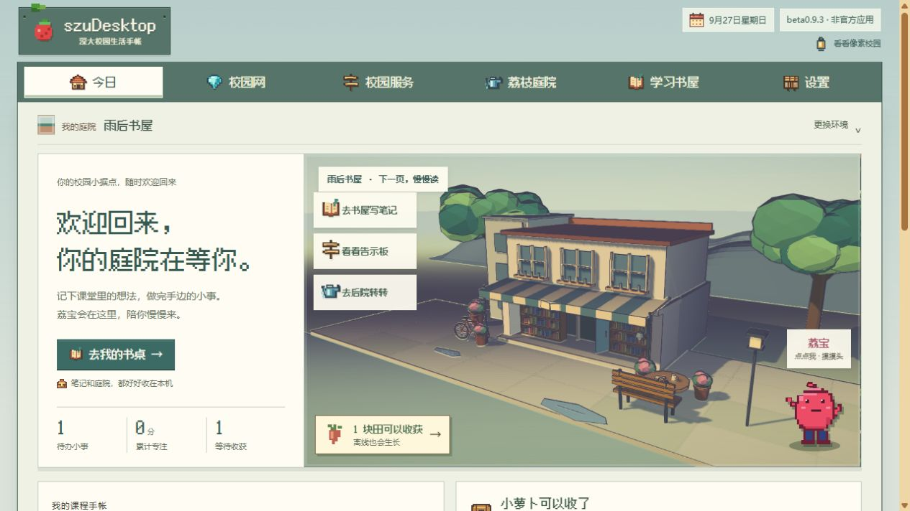

<div align="center">

# szuDesktop · Lychee Garden

A little piece of Shenzhen University, on your desktop.

Choose a pixel companion, spend a little time focusing, and come back to a harvest.
Your everyday campus tools live here too.

<p>
  
  
  
</p>

[简体中文](../README.md) · **English**

Unofficial · Built by a student · Not affiliated with Shenzhen University

Desktop app: Windows and macOS (macOS is a preview) · Linux: campus-network command line szunet (see [Download](#download))

**[Download for Windows · beta0.9.6](https://github.com/SzuDesktopTeam/szudesktop/releases/download/beta0.9.6/szuDesktop-Setup-0.9.6.exe)**

macOS preview: [Apple silicon DMG](https://github.com/SzuDesktopTeam/szudesktop/releases/download/beta0.9.6/szuDesktop-0.9.6-mac-arm64.dmg) · [Intel DMG](https://github.com/SzuDesktopTeam/szudesktop/releases/download/beta0.9.6/szuDesktop-0.9.6-mac-x64.dmg); you need to allow it by hand the first time you open it, see [Download](#download)

[Download](#download) · [Features](#features) · [Known limitations](#known-limitations) · [Privacy and security](#privacy-and-security) · [User guide (Chinese)](guide/README.md) · [FAQ](#faq) · [Feedback](https://github.com/SzuDesktopTeam/szudesktop/issues)

</div>

---

## What you can do today



- **Keep a companion on your desktop.** Choose Libao (荔宝), Chestnut (栗栗), Xiaobai (小白), Pingu or Skipper to keep you company while you study or work. Click to care for them, drag them where you like and scroll to resize; their names and growth stay on your computer. The desktop companion needs the Windows installer or the macOS app; the Windows portable edition has no standalone desktop companion.
- **Give focus a small reward.** Write a todo, start a 5, 25 or 45-minute focus session (or set your own length), then claim companion growth and garden coins (荔枝币). Grow crops, water them and build up the garden; crops keep growing while you are away.
- **Keep what you learn in class.** Write notes by course in the Study bookshop, with templates, search and Markdown. When you want to work on them with classmates, open the Feishu shared document linked to the course.
- **Spend less time hunting for school links.** Read public college notices and the official calendar, open common school services in one place, and run diagnostics when the campus network will not connect.

In the desktop app (Windows and macOS), the garden, todos, focus sessions and course notes need no school account and work offline.

[Companion room](screenshot-pets-preview.png) · [Course notes](screenshot-study-notes-preview.png) · [Garden construction](screenshot-garden-goal-preview.png)

The app interface and the detailed [user guide](guide/README.md) are currently in Chinese only: interface labels below give the English meaning followed by the Chinese text, and links to Chinese pages are marked (Chinese).

[Tell us what was awkward or what you would like next](https://github.com/SzuDesktopTeam/szudesktop/issues). Describe what you were trying to do and where you got stuck. Please leave out passwords, cookies and personal grades. If the network or a school service is failing, you can attach the diagnostic report copied from **Settings → About and updates → Feedback and suggestions** (设置 → 关于与更新 → 反馈与建议): it contains only structure, with no account, grades or timetable, and you can preview it before copying.

## Features

| Capability | Status | Notes | Guide (Chinese) |
| :-- | :-- | :-- | :-- |
| Lychee Garden | ✅ Available | Companion care, four crops, 2048 at the companion table, requests, the market, garden construction, visit stories and postcards, all running offline; no purchases or real-money trading | [Garden and companions](guide/garden.md) |
| Companions | ✅ Available | Five companions for new saves plus A-Qing (阿青), who stays under “Old friends” (老朋友) in older saves; 648 animation frames and 1,656 dialogue lines (in Chinese). Switch in the companion room or from the desktop companion menu | [Garden and companions](guide/garden.md) |
| Desktop companion | ✅ Available (Windows) · 🧪 Testing (macOS) | Windows installer: transparent window, left/right-click menu for care and switching companions, 40%–200% wheel scaling, dragging, hiding and a tray icon; size and position are restored after restart. The macOS app has the same features with a menu bar icon instead of the tray, but has not been verified on a real Mac; see the “macOS desktop app” row | [Garden and companions](guide/garden.md) |
| Environments | ✅ Available | Pixel Courtyard, Lakeside Daylight, After-rain Bookshop and Blue-hour Terrace; every page shares the chosen scene. With animation off it shows a still frame, and without 3D support it falls back to Pixel Courtyard | [Garden and companions](guide/garden.md) |
| Todos and focus | ✅ Available | Todos can be edited, dated, archived and restored; focus sessions last 5 / 25 / 45 minutes or a custom 1–120 minutes and can be linked to a todo. Each completed and claimed minute gives 1 garden coin and 1 growth point | [Study](guide/study.md) |
| Focus completion notifications | 🧪 Testing | Windows installer and macOS app: turn on focus completion reminders and **Do not disturb** (勿扰). On the Mac, if a notification cannot be delivered, the desktop companion reminds you with a speech bubble instead | [Study](guide/study.md) |
| Course notes | ✅ Available | Local text notes: courses created by hand, templates, search, Markdown, trash, page outline, turning a selected sentence into a todo, import/export and whole-notebook backup | [Study](guide/study.md) |
| Feishu course documents | 🧪 Testing | Each course can link to one Feishu document you have permission to access and open the original page; you can also import a read-only local copy with your own lark-cli. This is not two-way sync | [Study](guide/study.md) |
| College notices | 🟡 Partial | Of 28 colleges and faculties, 17 can be read in the app (with dates and original links) and the rest link to the official site; notices from Academic Affairs and the Graduate School can also be read in the app. The first visit asks you to choose your college, or you can fill in your college in Settings | [Campus services](guide/campus.md) |
| Official calendar and teaching week | ✅ Available | Checks the school's calendar page daily and reads new images with the text recognition built into the system (both the Windows and macOS apps); the teaching week can be adjusted by hand, and a failed read keeps the cache and explains why | [Campus services](guide/campus.md) |
| School login | 🧪 Testing | Sign in on the official school page, then return to the app to read that login; it is kept only until you exit the app | [Campus services](guide/campus.md) |
| Timetable | 🧪 Testing | Reads the undergraduate or graduate timetable according to your programme level; shown only for the current run | [Campus services](guide/campus.md) |
| Grades and GPA | 🟡 Partial | Paste or import CSV / TSV grades and calculate GPA locally. Online reading after login is still being tested and is not added to GPA automatically; PDF, image and XLSX files are not parsed | [Campus services](guide/campus.md) |
| Room availability (read-only) | 🟡 Partial | Read-only view of community rooms and half-hour availability; this computer must reach the school's internal services directly (usually on the campus network) | [Campus services](guide/campus.md) |
| In-app booking | 🧪 Testing | The installer opens the official booking page in a separate school window, where you choose a slot and submit it yourself; the portable edition opens it in your browser instead. The app never submits or grabs slots for you | [Campus services](guide/campus.md) |
| College piano rooms | 🧪 Testing | Read-only view of rooms and your own reservations with that system's own account; the login is kept in memory only | [Campus services](guide/campus.md) |
| Study reminders | ✅ Available | Add reminders by hand and export a standard ICS calendar file that alerts you 15 minutes before the start; a reminder is not a booking | [Campus services](guide/campus.md) |
| Common contacts | 🟡 Partial | Only numbers published on the university library's official website; other offices link to their official pages | [Campus services](guide/campus.md) |
| Campus network sign-in | 🧪 Testing | Detects the teaching area (SRun, 深澜) or the dormitory area (Dr.COM) and signs in; you can also sign out or choose the zone by hand | [Campus network](guide/network.md) |
| Access point ID (`ac_id`) | 🟡 Partial | Picks the ID in this order: set by hand → what worked on this port on this machine → the gateway redirect → trying IDs one by one, labelling IDs found by trying. If detection fails you can enter the ID by hand | [Campus network](guide/network.md) |
| Connection diagnostics | ✅ Available | Lists the zone decision, portal reachability, protocol fingerprint, whether a proxy has taken over the school domains, and a conclusion, in both the desktop app and the command line. Off campus it shows a neutral grey note instead of a warning | [Campus network](guide/network.md) |
| Connect to the campus network at startup | 🧪 Testing | Signs in at most once at startup with the remembered account, skipping when already online or when no sign-in portal is found; can be turned off | [Campus network](guide/network.md) |
| Command line szunet | 🧪 Testing | Single-file binaries for Windows, macOS and Linux that sign in, sign out, show status, detect the zone, run diagnostics and save the account (in the Keychain on macOS, in Secret Service on Linux) | [Campus network](guide/network.md) |
| Credential storage | ✅ Available (Windows) · 🧪 Testing (macOS) | The Windows desktop app encrypts the campus network account and password with DPAPI, and the macOS app stores them in the system Keychain (saving and reading them on a real Mac has not been verified yet). It saves them only after a successful sign-in with **Remember account and password after successful sign-in** (认证成功后记住账号密码) ticked; without a system secure store it refuses to save and never writes plain text | [Data and privacy](guide/data-and-privacy.md) |
| Saves and backups | ✅ Available | The garden and notes are saved separately on this computer, and a damaged save is restored from the previous copy automatically; daily backups of the last 3 days you used the app are kept as well. Export and import are available, and multiple windows do not overwrite each other; exported saves contain no campus network account or password | [Data and privacy](guide/data-and-privacy.md) |
| Feedback and diagnostic report | ✅ Available | Copy your version and system details, or a diagnostic report that contains only structure (zone, portals, which fields school services returned); preview it before copying, nothing is uploaded. Feedback currently goes through GitHub Issues and needs a GitHub account | [Data and privacy](guide/data-and-privacy.md) |
| Launch at login | 🧪 Testing | The Windows installer registers it only when you turn it on in Settings (uninstalling removes it), and the portable edition and `szunet autostart` can also set it. On the Mac it is **Launch when signing in to Mac** (登录 Mac 时启动), which needs the app in the Applications folder | [Install and update](guide/install.md) |
| Automatic updates | — Not supported | Nothing is downloaded or installed automatically; check for a new version by hand in **Settings → About and updates** (设置 → 关于与更新) and open the download page | [Install and update](guide/install.md) |
| macOS desktop app | 🧪 Testing | Preview: one DMG each for Apple silicon and Intel, macOS 13 or later. Same features as the Windows installer, with a menu bar icon instead of the tray. Not notarised by Apple, so you allow it by hand the first time you open it. None of the real-Mac checks has been done yet; the behaviour still to be confirmed is listed under [Known limitations](#known-limitations) | [Install and update](guide/install.md) |
| Linux desktop | — Not supported | Only the command-line szunet; a Linux desktop version is on the roadmap as a low-priority to-do | [Install and update](guide/install.md) |

Legend: ✅ Available · 🟡 Partial (covers only part of the scope, or has clear prerequisites) · 🧪 Testing (implemented, not yet verified in real use) · — Not supported

The specific gaps behind Partial and Testing are listed under [Known limitations](#known-limitations).

## Download

Windows users can download the installer above, run it and open szuDesktop. The installer includes its window runtime, so you do not need to install a browser or developer tools. The macOS preview has been available since beta0.9.5; Mac users pick the DMG for their chip (see the table below). Every other download is on the [releases page](https://github.com/SzuDesktopTeam/szudesktop/releases) too.

beta0.9.6 prerelease downloads: `szuDesktop-Setup-0.9.6.exe`, `szudesktop-beta0.9.6-windows-amd64.zip`, and macOS previews `szuDesktop-0.9.6-mac-arm64.dmg` / `szuDesktop-0.9.6-mac-x64.dmg`. See the [release page](https://github.com/SzuDesktopTeam/szudesktop/releases/tag/beta0.9.6) for actual publication status, asset sizes and checksums.

| Edition | File | How to open | Desktop companion and tray |
| :-- | :-- | :-- | :-- |
| Windows installer (recommended) | `szuDesktop-Setup-<version number>.exe` | Run the installer, then open szuDesktop; a standalone window with the background engine built in | Yes |
| Windows portable | `szudesktop-<release tag>-windows-amd64.zip`, or the single file `szudesktop-windows-amd64.exe` | Unzip and double-click `szudesktop.exe`; it opens a window in the local Edge / Chrome | No (the garden inside the window works as usual) |
| macOS app · Apple silicon (preview) | `szuDesktop-<version number>-mac-arm64.dmg` | Open the DMG, drag szuDesktop into Applications, then open it; allow it the first time (see below) | Yes, with a menu bar icon at the top of the screen instead of the tray |
| macOS app · Intel (preview) | `szuDesktop-<version number>-mac-x64.dmg` | As above | Yes, with a menu bar icon at the top of the screen instead of the tray |
| macOS command line | `szunet-darwin-amd64` (Intel), `szunet-darwin-arm64` (Apple silicon) | Run it in a terminal; campus network sign-in and diagnostics only | No |
| Linux command line | `szunet-linux-amd64`, `szunet-linux-arm64` | Run it in a terminal; campus network sign-in and diagnostics only | No desktop app |

The installer and DMG file names carry only the numeric version, while the portable ZIP carries the full release tag; the current version line above and the actual file names on the releases page show them. Each command-line szunet build is a single file of about 6.4–7.2 MB. Disk space used after installation has not been measured yet.

**The macOS app is a preview** and needs macOS 13 or later. Choose `mac-arm64.dmg` for Apple silicon (M1 and later) and `mac-x64.dmg` for an Intel processor; **Apple menu → About This Mac** shows the chip or processor. The app is not notarised by Apple, so macOS blocks it the first time you open it. On macOS 15 and later, go to **System Settings → Privacy & Security** and click **Open Anyway** near the bottom; on macOS 13 and 14, Control-click szuDesktop in Applications and choose **Open**. You need to do this again after every update. Some behaviour has not been verified on a real Mac yet, see [Known limitations](#known-limitations); the full steps are in [Download, install and update](guide/install.md) (Chinese).

Linux has only the command-line szunet for now, with no desktop version. On Windows you can also download the command-line `szunet-windows-amd64.exe` on its own.

- **Verify downloads**: every file has a matching `.sha256` for checking that the download is complete; it does not replace a publisher signature.
- **No code signing or notarisation**: the Windows installer and programs are unsigned, so SmartScreen or antivirus software may warn you on first run; the macOS app is not notarised by Apple, so allow it as described above. The code is open source: you can read it, or build it yourself and compare.
- **Manual updates**: there are no automatic updates. Before upgrading, open **Settings → Backups and privacy** (设置 → 存档与隐私) and click **Export garden and todos** (导出庭院与待办) and **Back up course notes** (备份课程笔记), then download and install the new version. A Windows installer upgrade keeps the garden, study records, the encrypted account configuration and desktop companion settings; both Windows editions share the same local records. On the Mac, quit with ⌘Q, drag the new version into Applications to replace the old one, and allow it again; your saves, notes and the account in the Keychain are not affected.

Checksum steps, uninstalling, opening and exiting, and launch at login are covered in [Download, install and update](guide/install.md) (Chinese).

## Getting started

1. A welcome guide appears the first time you open the app. Click **Meet my companion →** (去认识我的伙伴 →) and choose a companion in the companion room; in the Windows installer and the macOS app the desktop companion switches too. On the day you start, the **Who keeps you company today?** (今天谁陪你？) bar on the home page is open as well, so you can switch there.
2. Back on the home page, click **Start 5 minutes** (开始 5 分钟) and a focus session starts right away. When it ends, click **Complete and claim the reward** (完成并领取奖励) in **Study bookshop → Focus and tasks** (学习书屋 → 专注与小事) to get 5 garden coins and 5 growth points. The guide's **Focus for 5 minutes first** (先专注 5 分钟) button also starts 5 minutes right away and opens that page.
3. The home page's **Next step** (下一步) points to your first radish: it ripens in about a minute. Harvest it in **Lychee Garden → My farm** (荔枝庭院 → 我的农田) for 2 radishes and 1 growth point.
4. When you need the internet, open **Campus network** (校园网), enter your campus card number and unified identity password, and click **Sign in to the campus network** (登录校园网). If it fails, click **Run network diagnostics** (运行网络诊断). Off campus, the campus sign-in row shows a grey note, which is normal. Signing in to school services is separate from campus network sign-in; handle each when you need it.

None of the first three steps needs a school account, and all of them work offline. To see the welcome guide again, click **Welcome guide** (欢迎引导) at the bottom of the page; the **User guide ↗** (使用指南 ↗) link next to it opens the full guide. The full walkthrough is in [Getting started](guide/getting-started.md) (Chinese).

## Known limitations

- **Personal school services are still being tested**: undergraduate timetables, graduate timetables with scheduled classes, online grades, the installer's school-login handoff and signing in again after expiry, the complete in-app booking flow and college piano rooms have not passed real-account verification, so reads may fail or be incomplete. Room availability requires this computer to reach the school's internal services directly (usually on the campus network). Acceptance details are in [STATUS](STATUS.md#s50-2) (Chinese).
- **Campus network sign-in awaits on-site verification**: full sign-in, error messages, sign-out and reconnection in the teaching and dormitory areas have not been verified item by item on site, and automatic access point ID discovery behind a router before sign-in has not been tested. If detection fails, enter the ID by hand under **Advanced settings** (高级设置) in the sign-in form. Connecting at startup and the szunet command line use the same sign-in, so they share this status.
- **The macOS app is a preview**: none of the real-Mac checks has been done yet. First-open approval after downloading in a browser, the menu bar icon and the Dock, closing windows and full screen, saving before every way of quitting, the **Page** (页面) menu and copy and paste in the school and Feishu windows, Control-clicking the desktop companion and multiple displays, system notification permission and delivery, signing out and launch at login, saving and reading the account in the Keychain, macOS 13 and 14, and whether a “Local Network” permission prompt appears on the campus network all still need to be confirmed item by item on a real Mac; progress is in [STATUS](STATUS.md#s68-2) (Chinese). You need to allow the app again after every update. Hiding the app with ⌘H hides the desktop companion too; click **Show pet** (显示宠物) in the menu bar icon to bring back just the companion. When both the main window and the companion are hidden, focus reminders may arrive slightly late. This is the first macOS version, so upgrading between versions has not been verified. If something goes wrong, open a **Bug report** (问题反馈) in [Issues](https://github.com/SzuDesktopTeam/szudesktop/issues) with your macOS version, chip (Apple silicon or Intel) and the step where you got stuck.
- **No desktop app on Linux**: only the command-line szunet, which needs Secret Service (`secret-tool`) to save the account and refuses to save without it. On macOS the command line stores credentials in the Keychain, and the full save-then-read path has not been verified on a real Mac.
- **Unsigned, not notarised, no automatic updates, no cloud sync**: the Windows edition may show a security warning on first run and the macOS app must be allowed by hand; new versions are downloaded by hand. Data stays on this computer; the project runs no backend and offers no cloud sync.
- **Notes and Feishu**: course notes are text only, with no image attachments, slide parsing, formulas or AI summaries. The local Feishu copy is never written back, so this is not two-way sync; real authorisation, document import and multi-user collaboration are not verified.
- **Desktop behaviour awaiting real tests**: on Windows, whether focus completion notifications actually appear, whether the app really starts after you sign in again with **Launch when signing in to Windows** (登录 Windows 时启动) turned on, and behaviour with multiple displays, over long runs (resource use) and after sleep and wake (for the macOS items, see above).
- **Not integrated yet**: campus network balance, data usage, time and plans. Notices from 11 colleges are official-site links only. New calendar images depend on the text recognition built into the system, and recognition on Windows with an English system language still needs rechecking.
- **No real student trial yet**: the garden's pacing and long-term content will be adjusted based on trial feedback.

All open items are listed in [STATUS: current open items](STATUS.md#s1-1) (Chinese).

## FAQ

### Sign-in fails once I plug in my own router

The access point ID (`ac_id`) belongs to the wall port, not to the router; if detection fails, enter it under **Advanced settings** in the sign-in form, or use `--ac-id` on the command line. See the [campus network guide](guide/network.md) (Chinese).

### School systems won't open while a proxy is running

The Fake-IP mode of proxies such as Clash resolves school domains to fake addresses. If diagnostics or an error message says a proxy has taken over the school domains (代理软件接管了学校域名), set `szu.edu.cn` to connect directly, and in Fake-IP mode also add it to `fake-ip-filter` (the list of domains that do not get fake addresses). See the [campus network guide](guide/network.md) (Chinese).

### My antivirus or SmartScreen flags it

The installer and programs have no code signature, which can trigger these warnings; download from the release page and check the matching `.sha256`, but don't dismiss every security warning as a false positive. See the [install guide](guide/install.md) (Chinese).

### Does it keep running after I close the window?

In the Windows installer the desktop companion and tray keep running; quit fully with **Quit app** (退出应用) from the desktop companion menu or Settings, or **Exit** (退出) from the tray. In the macOS app the desktop companion and menu bar icon keep running; click the Dock icon to bring the main window back and press ⌘Q to quit fully. The portable edition exits about 10 seconds after all its windows close. See the [install guide](guide/install.md) (Chinese).

### Does it reconnect on its own in the background?

Not on a timer: the only automatic attempt is a single sign-in at startup with the remembered account, and you can turn that off too. See the [campus network guide](guide/network.md) (Chinese).

### Can I use it on a Mac or Linux?

On a Mac you can use the macOS desktop app preview (macOS 13 or later), with the desktop companion and a menu bar icon. Allow it the first time you open it as described under [Download](#download); some behaviour has not been verified on a real Mac yet, and feedback in Issues is welcome. Linux has only the command-line szunet, for campus network sign-in and diagnostics, with no desktop app or desktop companion. See the [install guide](guide/install.md) (Chinese).

Where your account and password are stored, moving to a new computer, a warning that the background engine is outdated and other questions are answered on the [FAQ page](guide/faq.md) (Chinese).

## Privacy and security

- **Data stays on this computer**: by default in the `.szunet` folder in your user directory. The garden save `workspace-v1.json` and course notes `notebook-v1.json` are stored separately, so export both when moving computers; an exported garden save contains no campus network account or password. The garden save and course notes are both unencrypted ordinary files, and so are their exports; only the campus network password and any school login state you save by hand are encrypted.
- **No telemetry or analytics**: to check for internet access and identify the access point ID, the program requests public connectivity-check addresses (such as Xiaomi's connect.rom.miui.com) without any account information, with the full list in the data guide; it contacts GitHub only when you check for updates yourself. When you open official school or Feishu pages, those services handle your data.
- **Campus network passwords are encrypted**: Windows uses DPAPI (it cannot be decrypted on another machine or under another user), macOS the Keychain and Linux Secret Service. Without a system secure store the app refuses to save and explains why, never writing a plain-text file. You can click **Delete saved credentials** (删除已保存凭据) under **Settings → Backups and privacy** at any time.
- **Bookings and other transactions happen on the university's own pages**: bookings, course selection and payments are yours to complete in the official systems, and the app never submits or grabs slots for you. Notices are read only from public school pages; the app is not a general-purpose web proxy.
- **The local service listens on this computer only**: it binds to `127.0.0.1`, rejects requests from other web pages, and its API also requires a random credential generated for each run. Other Windows users on the same computer cannot read your notes, saves or grades even if they find the port.
- **Dormitory-area sign-in is plain text**: the school's Dr.COM gateway uses HTTP, which is how the school's protocol works today; the teaching-area SRun portal uses HTTPS and keeps certificate verification.
- **Nothing that bypasses billing or shares your connection.** Please follow your university's network rules.

Details are in [Data, privacy and security](guide/data-and-privacy.md) (Chinese).

## Command line szunet

For when you don't want a window, or want campus network sign-in in a script. Single-file builds exist for Windows, macOS and Linux; see [Download](#download).

```text
szunet config set    # save the account first: interactive, the password is not echoed
szunet login         # sign in with the saved account; detects the teaching or dorm area
szunet status        # show the current zone and online state
szunet diag          # run this first when you can't connect, then follow its conclusion
szunet logout        # sign out
```

This tool is a third-party work, not affiliated with Shenzhen University. Don't use it alongside the official client, or they will sign each other out. Never put real credentials in shared scripts or logs. Replace `szunet` in the examples with the file you downloaded (such as `./szunet-darwin-arm64`); first-run steps on macOS / Linux, and all subcommands, flags and scripting usage, are in [Campus network and the szunet command line](guide/network.md) (Chinese).

## Contributing

Issues and pull requests are welcome. The build environment, pre-commit checks, the release process and the project's ground rules are in [CONTRIBUTING.md](../CONTRIBUTING.md) (Chinese); development progress and open items are in [docs/STATUS.md](STATUS.md#s1-1) (Chinese). Report security issues as described in [SECURITY.md](../SECURITY.md) (Chinese), and do not post exploitable details in a public issue.

## Changelog

beta0.9.6 adds one-click classroom notes and save-before-reload, with fixes for welcome-guide and notebook-restore save races. Real Windows Electron smoke verifies note persistence through the Go API. The earlier 45-minute run is browser-only evidence. Real campus login, sleep/resume, production signing and macOS on-device acceptance remain incomplete. See [CHANGELOG](../CHANGELOG.md) and [validation record](STATUS.md#s71) (Chinese).

## Acknowledgements

- [teleostnacl/LoveSzu](https://github.com/teleostnacl/LoveSzu): reference for undergraduate personal timetable endpoint paths and fields; implemented independently from those facts without copying its source code.
- [Fusion Pixel Font](https://github.com/TakWolf/fusion-pixel-font): by TakWolf, SIL Open Font License 1.1; the notice ships with the package as `FONT-LICENSE-OFL.txt`.
- [Sleepstars/SZU-login](https://github.com/Sleepstars/SZU-login): attribution for the SRun xEncode implementation is kept in [LICENSE](../LICENSE).
- [Clash Verge Rev](https://github.com/clash-verge-rev/clash-verge-rev) and [FZU Helper](https://github.com/west2-online/fzuhelper-app): references for interface hierarchy and how campus services are organised.
- [MattDong123/tools4szu](https://github.com/MattDong123/tools4szu): by Matt, used with the author's permission as research into the university's own system endpoints. No code was copied: the endpoint paths, dataset names and field names it documents were re-implemented in Go with explicit session-expiry detection. That repository declares no open-source licence, so this is an attribution of facts only and not a redistribution of its code.

## Licence

This project is released under the MIT licence; see [LICENSE](../LICENSE). Third-party components keep their own licences, which this project's MIT licence does not replace. Full notices are in [THIRD_PARTY_NOTICES.md](../THIRD_PARTY_NOTICES.md) (Chinese):

- Fusion Pixel Font: SIL Open Font License 1.1
- [Three.js 0.180.0](https://www.npmjs.com/package/three/v/0.180.0): MIT, Copyright © 2010-2025 three.js authors
- Toon-rendering modules adapted from [Sakura Crossing](https://github.com/Kenton-GMI/sakura-crossing/tree/de01898e89c7f6ab3fad93fa802f0f5ac66fbd81): MIT, Copyright (c) 2026 Kenton Wang
- Move and merge rules adapted from [2048](https://github.com/gabrielecirulli/2048/tree/478b6ec346e3787f589e4af751378d06ded4cbbc): MIT, Copyright (c) 2014 Gabriele Cirulli
- Electron and Chromium (installer edition only): their licences stay in the install directory

The installer puts the licence files for this project, the font, 2048, Three.js and Sakura Crossing in `resources/licenses/`; the portable ZIP keeps them in the extracted folder. The experimental VPN module's third-party provenance and licensing scope are still being verified, and default desktop builds do not include it. Names such as EasyConnect remain the property of their respective owners.

Pingu and Skipper from *Madagascar* are fan pixel characters drawn by this project, and the rights to the characters belong to their respective owners. This project's MIT licence does not cover these characters and does not imply official authorisation or endorsement.
