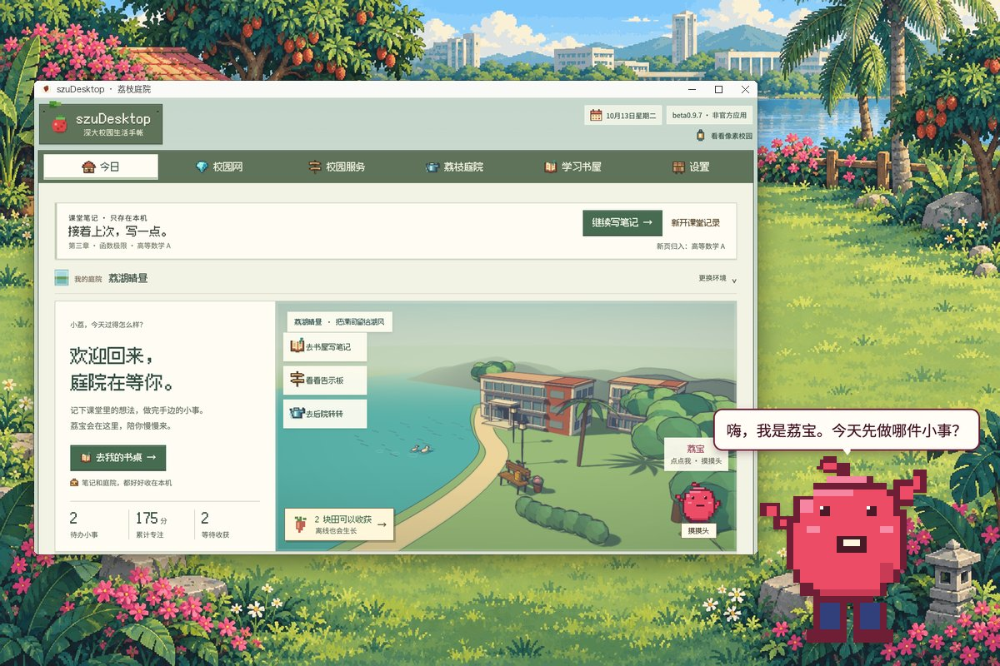
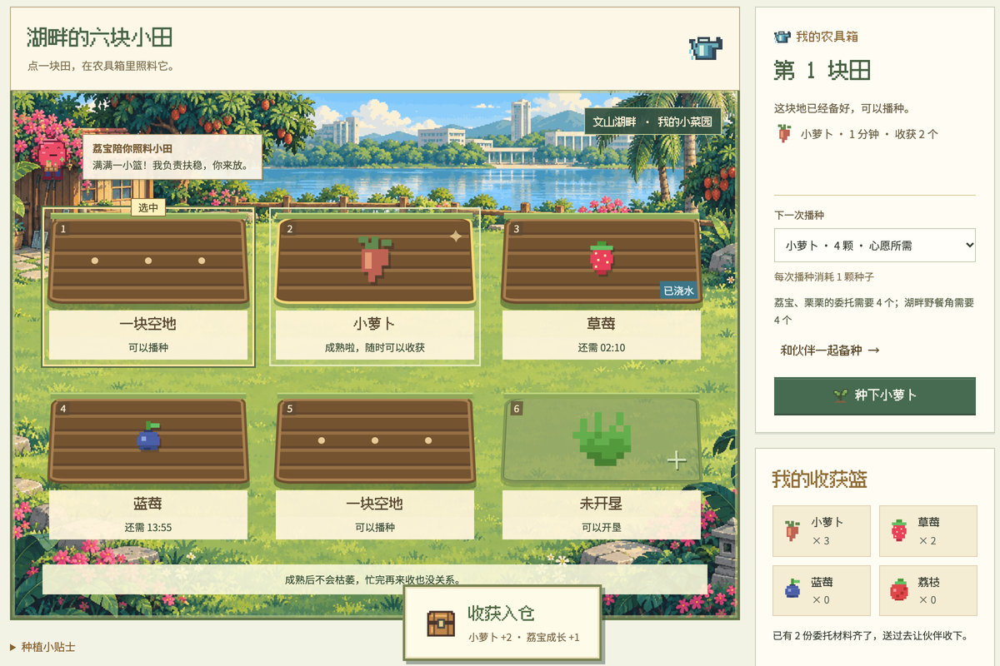
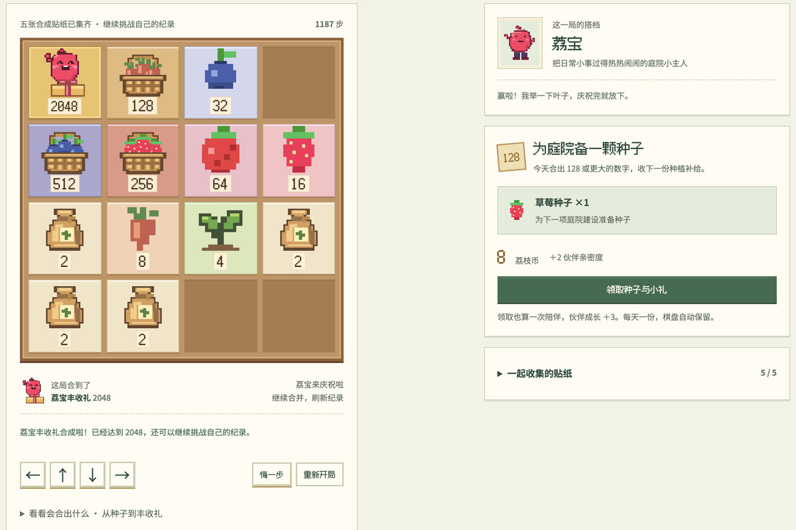
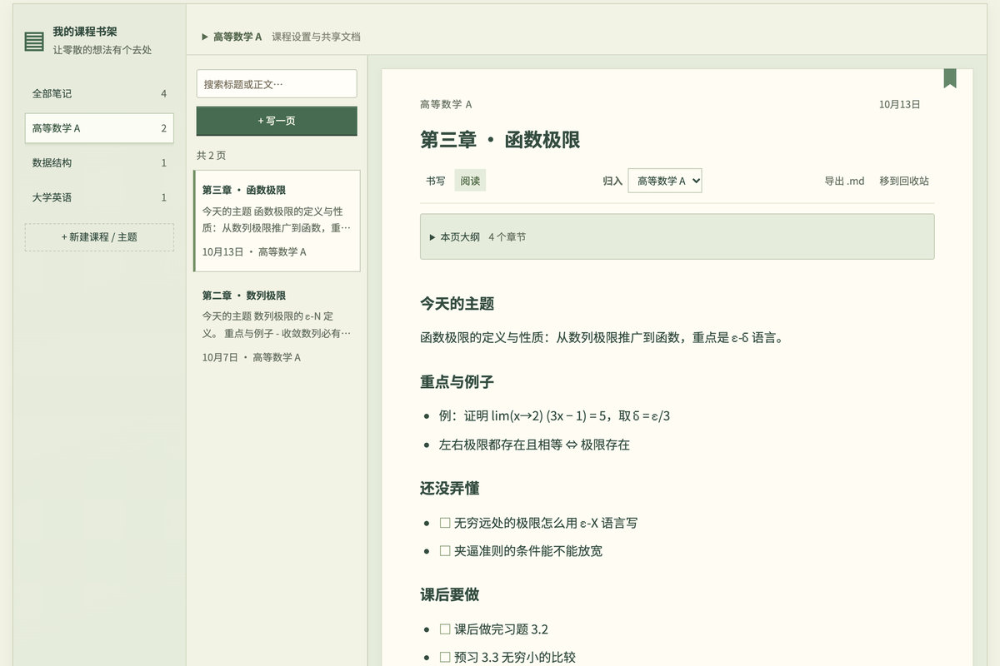
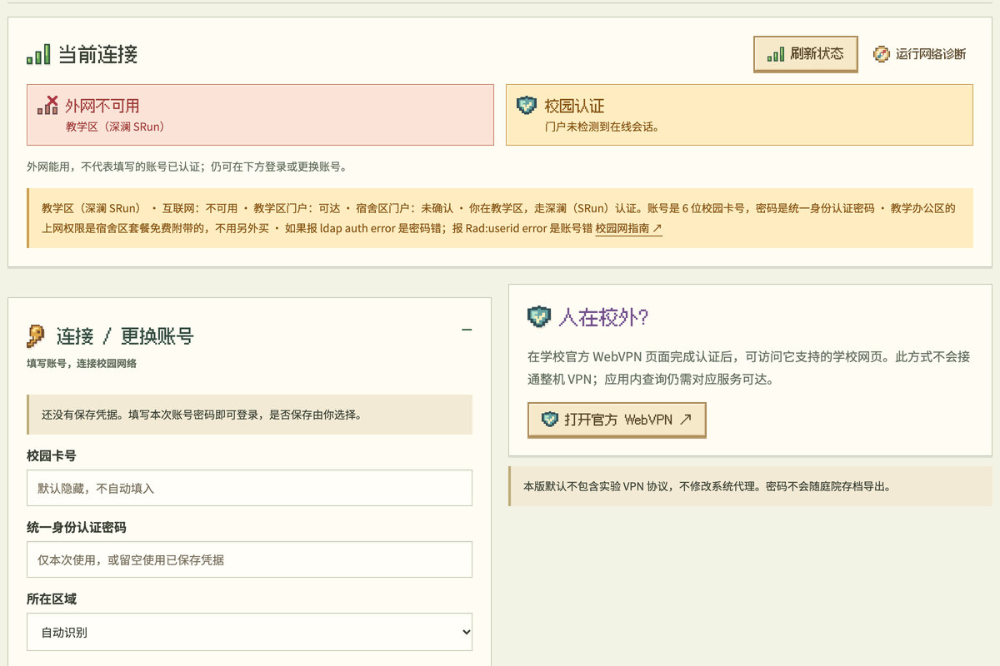

<div align="center">

# szuDesktop · Lychee Garden

**A little piece of Shenzhen University, on your desktop.**

Made and maintained by Shenzhen University students · Not affiliated with Shenzhen University

  

[简体中文](../README.md) · **English**


Choose a pixel companion, focus for a while, and come back to harvest a radish.<br>
Class notes, the official school calendar and campus network diagnostics are here too.

A computer app for Windows 10 / 11 (64-bit) or macOS 13 and later, with **no phone version**.<br>
If you are reading this on a phone, open this page on a computer to download it.

<a href="https://github.com/SzuDesktopTeam/szudesktop/releases/download/beta0.9.7/szuDesktop-Setup-0.9.7.exe"></a>
<a href="https://github.com/SzuDesktopTeam/szudesktop/releases/download/beta0.9.7/szuDesktop-0.9.7-mac-arm64.dmg"></a>
<a href="https://github.com/SzuDesktopTeam/szudesktop/releases/download/beta0.9.7/szuDesktop-0.9.7-mac-x64.dmg"></a>

**beta0.9.7** · Pre-release, planned as the last test version before 1.0 · Free and open source · Interface in Chinese<br>
Your system will block it the first time you open it; see [Download](#download) for how to allow it

▶ One-minute promo video (in Chinese): [Bilibili](https://www.bilibili.com/video/BV1wZpA66EVd/) · [Douyin](https://v.douyin.com/B47JYZ3oDTU/) · [Xiaohongshu](https://www.xiaohongshu.com/discovery/item/6ac514ab000000001402f08e?xsec_token=ABDDZO2ECkdAnJHuJuryd-K5E-n2N9TScBRz4FcAdYTQA=&xsec_source=pc_share)

[Download](#download) · [Getting started](#getting-started) · [Features](#features) · [Known limitations](#known-limitations) · [FAQ](#faq) · [Privacy and security](#privacy-and-security) · [User guide (Chinese)](guide/README.md) · [Feedback (Chinese)](guide/feedback.md)

</div>

## What you can do today

- **A companion on your desktop.** Cheerful, always-smiling Libao (荔宝), Chestnut (栗栗) the chestnut-coloured kitten guarding an empty cardboard box, Xiaobai (小白) the egret from Wenshan Lake and more: pick one to keep you company in a corner of your desktop. Click it to chat, pat its head or feed it, drag it anywhere, and scroll to resize it from 40% to 200%. Each companion keeps its own name and growth, and you can switch at any time. The desktop companion needs the Windows installer or the macOS app.
- **Focus earns rewards.** Write down one small task and start a 5, 25 or 45-minute focus session, or set your own length; every minute you complete and claim earns 1 garden coin (荔枝币) and 1 growth point.
- **Grow a small plot by the lake.** Radishes, strawberries, blueberries and lychees keep growing while you are away; use the harvest for companion requests or to build the lakeside picnic corner, and when you want a break, play a round of 2048 at the companion table. No purchases and no leaderboards.
- **Class notes stay on your computer.** Organised by course, with templates, search, Markdown and a page outline; select a sentence to turn it into a todo.
- **Fewer trips for small school errands.** Read the official school calendar and college notices without signing in (notices currently cover 17 colleges and faculties; the rest link to the official site), and open common school services from one place; when the campus network won't connect, diagnostics tell you which step is failing.

The garden, todos, focus and course notes need no school account and work offline. Your data stays on your own computer, with no telemetry, and the code is open source under the MIT licence. Personal school services such as timetables, grades and bookings, and campus network sign-in, are still being tested; see [Known limitations](#known-limitations).

<table>
<tr><td width="50%"><br><b>Desktop companion</b>: Libao waits beside the main window; click it to chat or pat its head, and drag it anywhere (illustration)</td>
<td width="50%"><br><b>My farm</b>: harvest ripe radishes into storage while Libao helps at the edge of the field; crops keep growing while you are away</td></tr>
<tr><td width="50%"><br><b>2048 at the companion table</b>: merge seed bags all the way up to Libao's harvest gift (荔宝丰收礼); reach 128 or more in a day and you can also claim a seed gift</td>
<td width="50%"><br><b>After-rain Bookshop</b>: one of the toon-shaded scenes built into the app; you can also switch to Lakeside Daylight, Blue-hour Terrace or Pixel Courtyard, and every page changes with it</td></tr>
<tr><td width="50%"><br><b>Course notes</b>: one shelf per course, with Markdown, templates, search and a page outline; notes are stored only on your computer</td>
<td width="50%"><br><b>Campus network diagnostics</b>: see which zone you are in, whether the sign-in portal is reachable and what to do next (demo data shown; campus network sign-in is still being verified on site)</td></tr>
</table>

The app and the full [user guide](guide/README.md) are in Chinese only. In this README, interface labels give the English meaning followed by the Chinese text, and links to Chinese pages are marked (Chinese).

If something feels awkward or there is a feature you would like, [tell us](guide/feedback.md) (Chinese). Feedback currently goes through GitHub Issues, which needs a GitHub account (free to sign up); a channel that needs no account is being prepared. Just say what you were trying to do and where you got stuck; please leave out passwords, cookies and personal grades. If the network or a school service is failing, you can attach the diagnostic report copied from **Settings → About and updates → Feedback and suggestions** (设置 → 关于与更新 → 反馈与建议): it contains only structure, with no account, grades or timetable, and you can preview it before copying.

## Download

szuDesktop is a computer app: if you are reading this on a phone, open this page on a computer to download it. Every file is on the GitHub [release page](https://github.com/SzuDesktopTeam/szudesktop/releases/tag/beta0.9.7); the current version is **beta0.9.7** (released 2026-10-05, pre-release).

- **Windows 10 / 11 (64-bit) · installer (recommended)**: [download `szuDesktop-Setup-0.9.7.exe`](https://github.com/SzuDesktopTeam/szudesktop/releases/download/beta0.9.7/szuDesktop-Setup-0.9.7.exe) (about 98 MB), run it and follow the prompts to install, then open szuDesktop. It brings its own window, so you do not need to install a browser or developer tools, and it has the desktop companion and the tray icon.
- **Windows · without installing**: [download the portable ZIP](https://github.com/SzuDesktopTeam/szudesktop/releases/download/beta0.9.7/szudesktop-beta0.9.7-windows-amd64.zip) (about 6.5 MB), unzip it and double-click `szudesktop.exe`, which opens its window in the Edge or Chrome already on your computer; the garden works as usual, but there is no desktop companion or tray icon. The release page also has the single file `szudesktop-windows-amd64.exe`.
- **Mac (preview, macOS 13 or later)**: for Apple silicon (M1 and later) download the [arm64 DMG](https://github.com/SzuDesktopTeam/szudesktop/releases/download/beta0.9.7/szuDesktop-0.9.7-mac-arm64.dmg) (about 123 MB), and for an Intel processor the [x64 DMG](https://github.com/SzuDesktopTeam/szudesktop/releases/download/beta0.9.7/szuDesktop-0.9.7-mac-x64.dmg) (about 130 MB); if you are not sure, check whether **Apple menu → About This Mac** lists a “Chip” or a “Processor”. Open the DMG, drag szuDesktop into Applications, then open it; it has the desktop companion, with a menu bar icon at the top of the screen instead of the tray.
- **Linux, or just the campus network**: use the [szunet command line](#command-line-szunet), which has no window and only handles campus network sign-in and diagnostics; there is no desktop version for Linux yet.

**Expect your system to block it the first time you open it**: the installer is not code-signed yet, and the Mac app is not notarised by Apple.
- **Windows**: if the browser says the file is not commonly downloaded, choose **Keep** (保留) in the download list (in Edge, click **…** next to the file first); if “Windows protected your PC” appears on first run, click **More info** (更多信息) and then **Run anyway** (仍要运行). Some antivirus software may warn you too.
- **Mac**: on macOS 15 and later, open it once, and after it is blocked go to **System Settings → Privacy & Security** and click **Open Anyway** near the bottom; on macOS 13 and 14, Control-click szuDesktop in Applications and choose **Open**. You need to allow it again after every update.
- Only allow files downloaded from this repository's release page, and don't dismiss every security warning as a false positive. Every file has a matching `.sha256` for checking that the download is complete, but it does not replace a publisher signature; the code is open source, so you can also read it, or build it yourself and compare.

**Updates are manual**: there are no automatic updates; you can check for a new version by hand in **Settings → About and updates** (设置 → 关于与更新). Before upgrading, click **Export garden and todos** (导出庭院与待办) and **Back up course notes** (备份课程笔记) under **Settings → Backups and privacy** (设置 → 存档与隐私). On Windows, just run the new installer: the garden, study records, the encrypted account configuration and desktop companion settings are all kept, and the installer and portable editions share the same local records. On the Mac, quit with ⌘Q first, drag the new version into Applications to replace the old one, and allow it once more; your saves, notes and the account in the Keychain are not affected. Checksum steps, uninstalling, opening and quitting, launch at login and other details are in [Download, install and update](guide/install.md) (Chinese).

## Getting started

1. **Choose a companion**: a welcome guide appears the first time you open the app; to see it again later, click **Welcome guide** (欢迎引导) at the bottom of the page. Click **Meet my companion →** (去认识我的伙伴 →) and choose one in the companion room; in the Windows installer and the macOS app the desktop companion switches too. On the day you start, the **Who keeps you company today?** (今天谁陪你？) bar on the home page is open as well, so you can switch there too.
2. **Focus for 5 minutes**: back on the home page, click **Start 5 minutes** (开始 5 分钟) and a focus session starts right away; **Focus for 5 minutes first** (先专注 5 分钟) in the welcome guide does the same. When time is up, click **Complete and claim the reward** (完成并领取奖励) in **Study bookshop → Focus and tasks** (学习书屋 → 专注与小事) to get 5 garden coins and 5 growth points.
3. **Harvest your first radish**: the home page's **Next step** (下一步) points to your first radish, which ripens in about a minute. Harvest it in **Lychee Garden → My farm** (荔枝庭院 → 我的农田) for 2 radishes and 1 growth point.
4. **Connect to the campus network when you need it**: open **Campus network** (校园网), enter your campus card number and unified identity password, and click **Sign in to the campus network** (登录校园网); if it fails, click **Run network diagnostics** (运行网络诊断). Off campus, the **Campus sign-in** (校园认证) row shows a grey note, which is normal. Signing in to school services is separate from campus network sign-in; handle each when you need it.

None of the first three steps needs a school account, and all of them work offline; the full walkthrough is in [Getting started](guide/getting-started.md) (Chinese). To start with class notes, click **New classroom note** (新开课堂记录) on the home page, write a few lines and leave; back on the home page, click **Continue writing →** (继续写笔记 →) to pick up where you left off. Notes save automatically on your computer, and **Save and reopen** (保存并重新打开) in Settings saves before reloading the page. If saving fails, keep the page open and retry or export a notes backup; see the [desktop first-minute guide](guide/desktop-first-minute.md) (Chinese).

## Features

This table is the reference for whether each feature is available, partial or still being tested; click a feature name to open its page in the user guide (Chinese).

| Capability | Status | Notes |
| :-- | :-- | :-- |
| [Lychee Garden](guide/garden.md) | ✅ Available | Companion care, four crops, 2048 at the companion table, requests, the market, garden construction, visit stories and postcards, all running offline; no purchases or real-money trading |
| [Companions](guide/garden.md) | ✅ Available | Five companions for new saves plus A-Qing (阿青), who stays under “Old friends” (老朋友) in older saves; 648 animation frames and 1,656 dialogue lines (in Chinese). Switch in the companion room or from the desktop companion menu |
| [Desktop companion](guide/garden.md) | ✅ Available (Windows) · 🧪 Testing (macOS) | Windows installer: transparent window, left/right-click menu for care and switching companions, 40%–200% wheel scaling, dragging, hiding and a tray icon; size and position are restored after restart. The macOS app has the same features, with a menu bar icon instead of the tray; everyday checks on a real Mac are not finished yet (see the “macOS desktop app” row) |
| [Environments](guide/garden.md) | ✅ Available | Pixel Courtyard, Lakeside Daylight, After-rain Bookshop and Blue-hour Terrace; every page shares the chosen scene. With animation off it shows a still frame, and without 3D support it falls back to Pixel Courtyard |
| [Todos and focus](guide/study.md) | ✅ Available | Todos can be edited, dated, archived and restored; focus sessions last 5 / 25 / 45 minutes or a custom 1–120 minutes and can be linked to a todo. Each completed and claimed minute gives 1 garden coin and 1 growth point |
| [Focus completion notifications](guide/study.md) | 🧪 Testing | Windows installer and macOS app: turn on focus completion reminders and **Do not disturb** (勿扰). On the Mac, if a notification cannot be delivered, the desktop companion reminds you with a speech bubble instead |
| [Course notes](guide/study.md) | ✅ Available | Local text notes: courses created by hand, templates, search, Markdown, trash, page outline, turning a selected sentence into a todo, import/export and whole-notebook backup |
| [Feishu course documents](guide/study.md) | 🧪 Testing | Each course can link to one Feishu document you have permission to access and open the original page; you can also import a read-only local copy with your own lark-cli. This is not two-way sync |
| [College notices](guide/campus.md) | 🟡 Partial | Of 28 colleges and faculties, 17 can be read in the app (with dates and original links) and the rest link to the official site; notices from Academic Affairs and the Graduate School can also be read in the app. The first visit asks you to choose your college, or you can fill in your college in Settings |
| [Official calendar and teaching week](guide/campus.md) | ✅ Available | Checks the school's calendar page daily and reads new images with the text recognition built into the system (both the Windows and macOS apps); the teaching week can be adjusted by hand, and a failed read keeps the cache and explains why |
| [School login](guide/campus.md) | 🧪 Testing | Sign in on the official school page, then return to the app to read that login; it is kept only until you exit the app |
| [Timetable](guide/campus.md) | 🧪 Testing | Reads the undergraduate or graduate timetable according to your programme level; shown only for the current run |
| [Grades and GPA](guide/campus.md) | 🟡 Partial | Paste or import CSV / TSV grades and calculate GPA locally. Online reading after login is still being tested and is not added to GPA automatically; PDF, image and XLSX files are not parsed |
| [Room availability (read-only)](guide/campus.md) | 🟡 Partial | Read-only view of community rooms and half-hour availability; this computer must reach the school's internal services directly (usually on the campus network) |
| [In-app booking](guide/campus.md) | 🧪 Testing | The installer opens the official booking page in a separate school window, where you choose a slot and submit it yourself; the portable edition opens it in your browser instead. The app never submits or grabs slots for you |
| [College piano rooms](guide/campus.md) | 🧪 Testing | Read-only view of rooms and your own reservations with that system's own account; the login is kept in memory only |
| [Study reminders](guide/campus.md) | ✅ Available | Add reminders by hand and export a standard ICS calendar file that alerts you 15 minutes before the start; a reminder is not a booking |
| [Common contacts](guide/campus.md) | 🟡 Partial | Only numbers published on the university library's official website; other offices link to their official pages |
| [Campus network sign-in](guide/network.md) | 🧪 Testing | Detects the teaching area (SRun, 深澜) or the dormitory area (Dr.COM) and signs in; you can also sign out or choose the zone by hand |
| [Access point ID (`ac_id`)](guide/network.md) | 🟡 Partial | Picks the ID in this order: set by hand → what worked on this port on this machine → the gateway redirect → trying IDs one by one, labelling IDs found by trying. If detection fails you can enter the ID by hand |
| [Connection diagnostics](guide/network.md) | ✅ Available | Lists the zone decision, portal reachability, protocol fingerprint, whether a proxy has taken over the school domains, and a conclusion, in both the desktop app and the command line. Off campus it shows a neutral grey note instead of a warning |
| [Connect to the campus network at startup](guide/network.md) | 🧪 Testing | Signs in at most once at startup with the remembered account, skipping when already online or when no sign-in portal is found; can be turned off |
| [Command line szunet](guide/network.md) | 🧪 Testing | Single-file binaries for Windows, macOS and Linux that sign in, sign out, show status, detect the zone, run diagnostics and save the account (in the Keychain on macOS, in Secret Service on Linux) |
| [Credential storage](guide/data-and-privacy.md) | ✅ Available (Windows) · 🧪 Testing (macOS) | The Windows desktop app encrypts the campus network account and password with DPAPI, and the macOS app stores them in the system Keychain (saving and reading a real account and the authorisation prompts have not been verified on a real Mac yet). It saves them only after a successful sign-in with **Remember account and password after successful sign-in** (认证成功后记住账号密码) ticked; without a system secure store it refuses to save and never writes plain text |
| [Saves and backups](guide/data-and-privacy.md) | ✅ Available | The garden and notes are saved separately on this computer, and a damaged save is restored from the previous copy automatically; daily backups of the last 3 days you used the app are kept as well. Export and import are available, and multiple windows do not overwrite each other; exported saves contain no campus network account or password |
| [Feedback and diagnostic report](guide/data-and-privacy.md) | ✅ Available | Copy your version and system details, or a diagnostic report that contains only structure (zone, portals, which fields school services returned); preview it before copying, nothing is uploaded. **Send feedback** (提交反馈) in the app opens the [feedback page](guide/feedback.md) (Chinese); feedback currently goes through GitHub Issues and needs a GitHub account |
| [Launch at login](guide/install.md) | 🧪 Testing | The Windows installer registers it only when you turn it on in Settings (uninstalling removes it), and the portable edition and `szunet autostart` can also set it. On the Mac it is **Launch when signing in to Mac** (登录 Mac 时启动), which needs the app in the Applications folder |
| [Automatic updates](guide/install.md) | — Not supported | Nothing is downloaded or installed automatically; check for a new version by hand in **Settings → About and updates** (设置 → 关于与更新) and open the download page |
| [macOS desktop app](guide/install.md) | 🧪 Testing | Preview: one DMG each for Apple silicon and Intel, macOS 13 or later. Same features as the Windows installer, with a menu bar icon instead of the tray. Not notarised by Apple, so you allow it by hand the first time you open it. Everyday checks on a real Mac are not finished yet; the behaviour still to be confirmed is listed under [Known limitations](#known-limitations) |
| [Linux desktop](guide/install.md) | — Not supported | Only the command-line szunet; a Linux desktop version is on the roadmap as a low-priority to-do |

Legend: ✅ Available · 🟡 Partial (covers only part of the scope, or has clear prerequisites) · 🧪 Testing (implemented, not yet verified in real use) · — Not supported. The specific gaps behind Partial and Testing are listed under [Known limitations](#known-limitations).

## Known limitations

- **Personal school services are still being tested**: undergraduate timetables, graduate timetables with scheduled classes, online grades, the installer's school-login handoff and signing in again after expiry, the complete in-app booking flow and college piano rooms have not been verified with real accounts yet, so reads may fail or be incomplete; the school's own systems are authoritative. Room availability requires this computer to reach the school's internal services directly (usually on the campus network). Acceptance details are in [STATUS](STATUS.md#s50-2) (Chinese).
- **Campus network sign-in is still being verified on site**: full sign-in, error messages, sign-out and reconnection in the teaching and dormitory areas have not been verified item by item on site, and automatic access point ID discovery behind a router before sign-in has not been tested either. If detection fails, enter the ID by hand under **Advanced settings** (高级设置) in the sign-in form. Connecting at startup and the szunet command line use the same sign-in, so they share this status.
- **The macOS app is a preview**: everyday checks on a real Mac are not finished yet. Still to be confirmed: first-open approval, the menu bar icon and the Dock, closing windows and full screen, saving before every way of quitting, the **Page** (页面) menu and copy and paste in the school and Feishu windows, Control-clicking the desktop companion and multiple displays, system notifications, signing out and launch at login, saving and reading the account in the Keychain, macOS 13 and 14, and whether a “Local Network” permission prompt appears on the campus network; progress is in [STATUS](STATUS.md#s68-2) (Chinese). Hiding the app with ⌘H hides the desktop companion too; click **Show companion** (显示伙伴) in the menu bar icon to bring back just the companion. When both the main window and the companion are hidden, focus reminders may arrive slightly late. Upgrading from the previous version has only been verified in automated tests, not yet on a real Mac. If something goes wrong, tell us as described on the [feedback page](guide/feedback.md) (Chinese), with your macOS version, chip (Apple silicon or Intel) and the step where you got stuck.
- **No desktop app on Linux**: only the command-line szunet, which needs Secret Service (`secret-tool`) to save the account and refuses to save without it. On macOS the command line stores the account in the Keychain, and the full save-then-read path has not been verified on a real Mac.
- **Unsigned, not notarised, no automatic updates, no cloud sync**: the Windows edition may show a security warning on first run and the macOS app must be allowed by hand; new versions are downloaded by hand. Data stays on this computer; the project runs no backend.
- **Notes and Feishu**: course notes are text only, with no image attachments, slide parsing, formulas or AI summaries. The local Feishu copy is never written back, so this is not two-way sync; real authorisation, document import and multi-user collaboration are not verified.
- **Desktop behaviour awaiting real tests**: on Windows, whether focus completion notifications actually appear, whether the app really starts after you sign in again with **Launch when signing in to Windows** (登录 Windows 时启动) turned on, and behaviour with multiple displays, over long runs (resource use) and after sleep and wake.
- **Not integrated yet**: campus network balance, data usage, time and plans. Notices from 11 colleges are official-site links only. New calendar images depend on the text recognition built into the system, and recognition on Windows with an English system language still needs rechecking.
- **The garden's pacing will still change**: it has not had a long trial with real students yet, so growth pacing and long-term content will be adjusted based on your feedback.

All open items are listed in [STATUS: current open items](STATUS.md#s1-1) (Chinese).

## FAQ

- **Is it official? Does it cost anything?** It is not official: szuDesktop is made and maintained by Shenzhen University students and is not affiliated with Shenzhen University. It is free to download, the code is open source under the MIT licence, and the app has no purchases or real-money trading.
- **Does it work on a phone, a Mac or Linux?** There is no phone version. On a Mac you can use the macOS preview (macOS 13 or later), with the desktop companion and a menu bar icon; allow it the first time you open it as described under [Download](#download), and note that some behaviour has not been verified on a real Mac yet. Linux has only the command-line szunet, for campus network sign-in and diagnostics.
- **Browser blocking the download, or antivirus or SmartScreen warning you?** The installer and programs have no code signature, so they get blocked once; the steps to allow them are under [Download](#download). Only allow files downloaded from the release page and checked against the matching `.sha256`.
- **Does it keep running after I close the window?** In the Windows installer the desktop companion and tray keep running; quit fully with **Quit app** (退出应用) from the desktop companion menu or Settings, or **Exit** (退出) from the tray. In the macOS app the desktop companion and menu bar icon keep running; click the Dock icon to bring the main window back and press ⌘Q to quit fully. The portable edition exits about 10 seconds after all its windows close.
- **Does it reconnect to the campus network on its own in the background?** Not on a timer: the only automatic attempt is a single sign-in at startup with the remembered account, and you can turn that off too.
- **Sign-in fails once I plug in my own router?** The access point ID (`ac_id`) belongs to the wall port, not to the router; if detection fails, enter it under **Advanced settings** (高级设置) in the sign-in form, or use `--ac-id` on the command line.
- **School systems won't open while a proxy is running?** The Fake-IP mode of proxies such as Clash resolves school domains to fake addresses. If diagnostics or an error message says a proxy has taken over the school domains (代理软件接管了学校域名), set `szu.edu.cn` to connect directly, and in Fake-IP mode also add it to `fake-ip-filter` (the list of domains that do not get fake addresses).
- **Can't connect to the campus network and want to troubleshoot it yourself?** First click **Run network diagnostics** (运行网络诊断) in the app. For the original error messages and what they mean, plan and proxy problems and how to report a fault to the university, see the [Shenzhen University campus network troubleshooting guide](深圳大学校园网连不上排查指南.md) (Chinese) and the [campus network guide](guide/network.md) (Chinese).
- **Anything else?** Where your account and password are stored, moving to a new computer, a warning that the background engine is outdated and more are answered on the [FAQ page](guide/faq.md) (Chinese); if you can't find your answer, ask as described on the [feedback page](guide/feedback.md) (Chinese).

## Privacy and security

- **Data stays on this computer**: by default in the `.szunet` folder in your user directory. The garden save `workspace-v1.json` and course notes `notebook-v1.json` are stored separately, so export both when moving computers; an exported garden save contains no campus network account or password. The garden save and course notes are both unencrypted ordinary files, and so are their exports; only the campus network password and any school login state you save by hand are encrypted.
- **No telemetry or analytics**: to check for internet access and identify the access point ID, the program requests public connectivity-check addresses (such as Xiaomi's connect.rom.miui.com) without any account information, with the full list in the data guide; it contacts GitHub only when you check for updates yourself. When you open official school or Feishu pages, those services handle your data.
- **Campus network passwords are encrypted**: Windows uses DPAPI (it cannot be decrypted on another machine or under another user), macOS the Keychain and Linux Secret Service. Without a system secure store the app refuses to save and explains why, never writing a plain-text file. You can click **Delete saved credentials** (删除已保存凭据) under **Settings → Backups and privacy** at any time.
- **Bookings and other transactions happen on the university's own pages**: bookings, course selection and payments are yours to complete in the official systems, and the app never submits or grabs slots for you. Notices are read only from public school pages; the app is not a general-purpose web proxy.
- **The local service listens on this computer only**: it binds to `127.0.0.1`, rejects requests from other web pages, and its API also requires a random credential generated for each run. Other Windows users on the same computer cannot read your notes, saves or grades even if they find the port.
- **Dormitory-area sign-in is plain text**: the school's Dr.COM gateway uses HTTP, which is how the school's protocol works today; the teaching-area SRun portal uses HTTPS and keeps certificate verification.
- **Nothing that bypasses billing or shares your connection.** Please follow your university's network rules.

Details are in [Data, privacy and security](guide/data-and-privacy.md) (Chinese).

## Command line szunet

For when you don't want a window, or want campus network sign-in in a script. Download the single file for your system from the assets of the newest release on the [release page](https://github.com/SzuDesktopTeam/szudesktop/releases): `szunet-windows-amd64.exe` on Windows, `szunet-darwin-arm64` (Apple silicon) or `szunet-darwin-amd64` (Intel) on macOS, and `szunet-linux-amd64` or `szunet-linux-arm64` on Linux.

```text
szunet config set    # save the account first: interactive, the password is not echoed
szunet login         # sign in with the saved account; detects the teaching or dorm area
szunet status        # show the current zone and online state
szunet diag          # run this first when you can't connect, then follow its conclusion
szunet logout        # sign out
```

This tool is a third-party work, not affiliated with Shenzhen University. Don't use it alongside the official client, or they will sign each other out. Never put real credentials in shared scripts or logs. Replace `szunet` in the examples with the file you downloaded (such as `./szunet-darwin-arm64`); first-run steps on macOS / Linux, and all subcommands, flags and scripting usage, are in [Campus network and the szunet command line](guide/network.md) (Chinese).

## Contributing

Issues and pull requests are welcome. The build environment, pre-commit checks, the release process and the project's ground rules are in [CONTRIBUTING.md](../CONTRIBUTING.md) (Chinese); development progress and open items are in [docs/STATUS.md](STATUS.md#s1-1) (Chinese). Report security issues as described in [SECURITY.md](../SECURITY.md) (Chinese), and do not post exploitable details in a public issue.

## Changelog

The current version, **beta0.9.7** (2026-10-05), is the first trial build and, as planned, the last test version before the 1.0 release; from here to 1.0 only problems found in the trial will be fixed. Compared with beta0.9.6: caring for the companion while the main window is hidden no longer leaves the main window drawing animations in the background and using extra power (the window runtime is updated to 44.5.1); the tray, companion menu and notifications use the same wording as Settings and the user guide; **Send feedback** (提交反馈) now opens a [feedback page](guide/feedback.md) (Chinese); when you are already online it shows whether you are in the teaching or dormitory area, and the diagnostic report says whether the system proxy is on; and in the portable edition the countdown in the tab title no longer freezes when you switch to another tab during a focus session. Still on beta0.9.6? Please upgrade: in the old version, the background animation only stops after you open the main window once and close it again.

Installing and upgrading this version went through automated checks, and every download was checked one by one after release. Real campus login and campus network sign-in, sleep and resume, multiple displays and long-term use, publisher signing and hands-on checks on a real Mac are not finished, so this is still a pre-release; the release and verification record is in [STATUS](STATUS.md#s73-5) (Chinese). The full version history is in [CHANGELOG.md](../CHANGELOG.md) (Chinese), and every download is on [Releases](https://github.com/SzuDesktopTeam/szudesktop/releases).

## Acknowledgements

- [teleostnacl/LoveSzu](https://github.com/teleostnacl/LoveSzu): reference for undergraduate personal timetable endpoint paths and fields; implemented independently from those facts without copying its source code.
- [Fusion Pixel Font](https://github.com/TakWolf/fusion-pixel-font): by TakWolf, SIL Open Font License 1.1; the notice ships with the package as `FONT-LICENSE-OFL.txt`.
- [Sleepstars/SZU-login](https://github.com/Sleepstars/SZU-login): attribution for the SRun xEncode implementation is kept in [LICENSE](../LICENSE).
- [Clash Verge Rev](https://github.com/clash-verge-rev/clash-verge-rev) and [FZU Helper](https://github.com/west2-online/fzuhelper-app): references for interface hierarchy and how campus services are organised.
- [MattDong123/tools4szu](https://github.com/MattDong123/tools4szu): by Matt, used with the author's permission as research into the university's own system endpoints. No code was copied: the endpoint paths, dataset names and field names it documents were re-implemented in Go with explicit session-expiry detection. That repository declares no open-source licence, so this is an attribution of facts only and not a redistribution of its code.

## Licence

This project is released under the MIT licence; see [LICENSE](../LICENSE). Third-party components keep their own licences, which this project's MIT licence does not replace. Full notices are in [THIRD_PARTY_NOTICES.md](../THIRD_PARTY_NOTICES.md) (Chinese):

- Fusion Pixel Font: SIL Open Font License 1.1
- [Three.js 0.180.0](https://www.npmjs.com/package/three/v/0.180.0): MIT, Copyright © 2010-2025 three.js authors
- Toon-rendering modules adapted from [Sakura Crossing](https://github.com/Kenton-GMI/sakura-crossing/tree/de01898e89c7f6ab3fad93fa802f0f5ac66fbd81): MIT, Copyright (c) 2026 Kenton Wang
- Move and merge rules adapted from [2048](https://github.com/gabrielecirulli/2048/tree/478b6ec346e3787f589e4af751378d06ded4cbbc): MIT, Copyright (c) 2014 Gabriele Cirulli
- Electron and Chromium (installer edition only): their licences stay in the install directory

The installer puts the licence files for this project, the font, 2048, Three.js and Sakura Crossing in `resources/licenses/`; the portable ZIP keeps them in the extracted folder. The experimental VPN module's third-party provenance and licensing scope are still being verified, and default desktop builds do not include it. Names such as EasyConnect remain the property of their respective owners.

Pingu and Skipper from *Madagascar* are fan pixel characters drawn by this project, and the rights to the characters belong to their respective owners. This project's MIT licence does not cover these characters and does not imply official authorisation or endorsement.
